# 策略研究 Agent 架构（实施规格）

> 定位：从零构建的加密资产策略研究 Agent 项目完整实施规格。设计融合了**确定性信号层**（数值先算好再喂 LLM，可复现可回测）、**多分析师视角采证**（四维度事实 + 通用联网搜索）、**对抗复审**（反方挑战 + 逐条回应）、**确定性风控终审**（只降不升）与**可校验工件落盘**（候选清单 + 分级）。
> 本文档为实施规格，可直接按第八节任务清单从空项目开始构建。
>
> 阅读顺序：项目结构（〇）→ 拓扑（一）→ State 数据字典（二）→ 节点规格（三）→ Prompt（四）→ 执行轨迹（五）→ 错误矩阵（六）→ 成本（七）→ 任务清单（八）→ 决策（九）→ 纪律（十）。

## 〇、项目结构与模块规划（从零构建清单）

**技术栈基线（已确认）**：Python 3.14（虚拟环境 `/home/lhh/Projects/python_projects/.venv`，依赖用 `uv pip` 管理；若 LangGraph 与 3.14 兼容受阻，兜底建 3.12 venv）；图框架 **LangGraph + LangChain**（`create_react_agent` / `with_structured_output` / `with_retry`）；LLM = **DeepSeek deepseek-chat**（json_mode 走 `response_format=json_object` 通道，任务 9 冒烟验证）；行情数据 = **Binance 官方 SDK**（`binance-sdk-spot` / `binance-sdk-derivatives-trading-usds-futures` / `binance-common`，已实测：Python 3.14 导入与现货/合约端点直连全部通过，现货 `ticker24hr`、合约 `mark_price` / `ticker24hr_price_change_statistics` 均返回真实数据）；数据源 HTTP 其余部分（defillama/web）= **httpx**（sync 模式，与 ThreadPoolExecutor 兼容）；测试框架 **pytest**。

| 模块 | 职责 | 关键设计要点 |
| --- | --- | --- |
| `datasources/` | 免费数据源装配层 | `web.py`（Bing News RSS + Web RSS，零 key）、`defillama.py`、`binance.py`（**官方 SDK 薄适配**，含 `fetch_ticker_24h_all` 全市场 24hr ticker）、`binance_futures.py`（**官方 SDK 薄适配**，含微观结构端点：mark_price / openInterestHist / globalLongShortAccountRatio / topLongShortAccountRatio|PositionRatio / takerlongshortRatio / exchangeInfo（含 `fetch_listing_days` 全量 onboardDate））、`mock.py`；SDK 调用模式：`Spot(config_rest_api=...).rest_api` 惰性单例 + `to_plain()` 解包（pydantic→dict）+ 429/418 权重限流退避（参考 BinanceApi 项目已验证的 `WeightBudget` 模式）；数据点一律 `{value, source, timestamp, confidence}` 包装；**失败即失败**：数据源失败该数据点标记 error/UNKNOWN，绝不回退 mock（mock 仅限 `SR_MOCK=1` 显式离线模式）；`SR_MOCK=1` 时零外部请求 |
| `screener.py` | 确定性币种筛选（图外入口） | 全市场 24hr ticker + exchangeInfo 各 1 次拉取；规则引擎：Filter（次新 / 流动性下限 / 排除稳定币）AND 依次过滤 → Rank（波动榜 / 涨跌榜 / 成交额榜）排序取 Top N，零 LLM；`SR_TOKENS` 手动覆盖跳过筛选；快照失败抛 `ScreeningError` 批终止（全架构唯一允许终止的节点）；mock 返回固定候选 |
| `signals.py` | 确定性信号计算 | 纯函数无 IO：`valuation_ratios` / `momentum_score` / `divergence` / `sentiment_raw`；任何输入缺失 → `None`（UNKNOWN 纪律），绝不猜测 |
| `schemas.py` | LLM 结构化输出 schema + 4 份 prompt | `TokenAnalysis`（含 direction）带宽容 validator（变体字段归一/默认值/白名单）；`FactItem` / `ChallengeItem` / `RebuttalItem`；`ANALYZE_PROMPT` / `FACTS_PROMPT` / `CHALLENGE_PROMPT` / `FINALIZE_PROMPT` |
| `tools.py` | react agent 工具 | 两个注册表：`FACTS_TOOLS`（③ 用，5 个：`get_tvl_history` / `get_fees_history` / `get_funding_history` / `get_stablecoin_history`（历史序列）+ `search_web`（六维查询模板））/ `CHALLENGE_TOOLS`（⑤ 用，4 个，**不含 search_web**——对抗者不给联网搜索）；降采样 ≤10 点；工具层永不抛异常 |
| 依赖 | langgraph / langchain（含 langchain-openai 适配 deepseek）/ httpx / binance-sdk-spot / binance-sdk-derivatives-trading-usds-futures / binance-common / pydantic / pytest | uv pip 安装进 `.venv` |
| `state.py` | 全局状态 | TypedDict，后写覆盖语义（每字段每 symbol 恰好写一次，无 reducer）；字段来源 = 数据流 |
| `nodes.py` | 图节点 | 8 个节点，线性装配；条件全在节点内部；批处理永不中断 |
| `graph.py` | 图组装 | `START → ①→②→③→④→⑤→⑥→⑦→⑧ → END`，9 条边全实线，无条件路由 / Command / interrupt / checkpointer |
| `report.py` | 报告落盘 | `overview.md` + `run.json` + `candidates.json` + `snapshot.json` + `signal_diff.json`；渲染异常仅记 meta 不中断 |
| `main.py` | 入口 | 模式互斥二选一：`--tokens`/`SR_TOKENS` 手动指定（跳过筛选，`meta.screening.mode="manual"`）或 `screener.select_tokens()` 确定性筛选（`mode="auto"`）→ 建图；`SR_MOCK=1` 全离线回归 |

## 一、目标拓扑（编译期结构）：8 节点线性图，边上标注数据流

```mermaid
flowchart TD
    classDef DET fill:#e8f5e9,stroke:#2e7d32,color:#1b5e20;
    classDef LLM fill:#fff3e0,stroke:#e65100,color:#bf360c;
    classDef OUT fill:#e3f2fd,stroke:#1565c0,color:#0d47a1;
    classDef SCR fill:#f3e5f5,stroke:#6a1b9a,color:#4a148c;

    SCR["⑨ screener · 确定性（图外入口）<br/>全市场快照各 1 次拉取<br/>次新/流动性过滤 → 波动榜 Top N"]
    START([START])
    CD["① collect_data · 确定性<br/>共享资源批内一次<br/>per-token 并发快照（含微观结构）"]
    CS["② compute_signals · 确定性<br/>估值/动量/背离<br/>+ sentiment 拥挤度"]
    RF["③ research_facts · LLM<br/>四分析师视角采证<br/>react agent + FACTS_TOOLS 5 个<br/>（含 search_web 六维查询模板）"]
    DC["④ decide · LLM<br/>json_mode 单次调用<br/>禁止 tools，引用信号"]
    CH["⑤ challenge · LLM<br/>PASS→透传；TRADE/WATCH<br/>风控三人组视角挖反方"]
    FN["⑥ finalize · LLM<br/>无挑战→透传维持<br/>逐条 rebutted/accepted"]
    RK["⑦ risk_check · 确定性<br/>EV/最大损失/集中度（风控终审）<br/>TRADE 不达标→降级 WATCH"]
    WR["⑧ write_report · 工件<br/>对抗/风控渲染<br/>+ candidates 工件（tier 分层）"]
    DONE([END])

    SCR -->|"tokens<br/>meta.screening"| START
    START -->|"tokens"| CD
    CD -->|"market_data<br/>fundamental_data<br/>web_data, meta"| CS
    CS -->|"signals（含 sentiment）"| RF
    RF -->|"facts（带 dimension/topic）"| DC
    DC -->|"decisions"| CH
    CH -->|"challenges（带 stance）"| FN
    FN -->|"final_decisions"| RK
    RK -->|"risk_flags"| WR
    WR -->|"meta.report_path"| DONE

    class CD,CS,RK DET
    class RF,DC,CH,FN LLM
    class WR OUT
    class SCR SCR
```



**编译期保证**：9 条边全实线直连，无条件边 / 无循环 / 无并行汇入——图编译永远成功。行为分化全部发生在节点内部（⑤ 是否调 LLM、⑥ 是否调 LLM、⑦ 是否核验），不跨边路由。**⑨ 筛选器不在编译期图内**：它是 `main.py` 的入口装配（先选币、后建图），图仍 8 节点 9 条边，`tokens` 只是它的输出。

## 二、State 数据字典（字段级，标注数据域来源）

7 个 LLM/对抗产物字段（`facts` / `decisions` / `challenges` / `final_decisions` / `risk_flags` / `research_artifacts` / `llm_calls`）全部**后写覆盖**（每 symbol 每节点恰好写一次），无需 reducer。

| State 字段 | 数据域 | 写入 | 读取 | 结构（嵌套到叶子） |
| --- | --- | --- | --- | --- |
| `tokens` | 输入（⑨ 筛选器产出） | — | 全部 | `list[str]`：⑨ 确定性筛选结果；`SR_TOKENS` 手动覆盖时跳过筛选 |
| `market_data` | 确定性层 | ① | ②③⑦⑧ | `dict[symbol, {price, change_24h, quote_volume_24h, change_7d, change_30d, change_90d, change_1y, funding, funding_avg_7d, funding_trend, oi, basis, taker_buy_ratio_24h, listing_days, error, futures_error, incomplete}]`（数据点均 `{value, source, timestamp, confidence}` 包装） |
| `fundamental_data` | 确定性层 | ① | ②③⑧ | `dict[symbol, {kind, name, category, resolved, tvl, tvl_change_7d, tvl_change_30d, tvl_change_1d, mcap, fdv, fees_24h, fees_7d, revenue_24h, revenue_7d, stablecoin_supply, dex_volume_24h, error, incomplete}]` |
| **`microstructure_data`** | 确定性层 | ① | ②③⑧ | `dict[symbol, {oi_change_24h, oi_change_48h, oi_value_change_24h, ls_ratio_all, ls_ratio_all_change_24h, ls_ratio_top_acc, ls_ratio_top_pos, taker_bs_ratio, board: list[str] \| None, error}]`（board = 多窗口涨跌榜共振，需全市场 klines 扫描器，Phase 2 扩展，PoC 阶段 None） |
| `web_data` | 确定性层 + 新闻/催化剂 | ① | ③⑧ | `dict[symbol, {symbol, items: list[{date,title,source}] \| None, web_error, incomplete}]` |
| `signals` | 确定性层 + 情绪维度 | ② | ③④⑦⑧ | `dict[symbol, {symbol, valuation:{value:{mc_fees,fdv_revenue,mc_tvl,fees_tvl}}, momentum:{value}, divergence:{value:{divergence_7d,divergence_30d,quadrant}}, sentiment:{components:{funding,funding_trend,long_short_ratio,top_trader_ratio}, note}, error}]`（sentiment 为持仓指标原始直读，无阈值打分） |
| **`facts`** | 确定性层 + 分析师 | ③ | ④⑤⑧ | `dict[symbol, list[FactItem]]`：`{claim, source, timestamp, direction: bull/bear/neutral, dimension: fundamentals/market/sentiment/news, topic: project/team/social/adoption/unlock/catalyst/news/unknown}` |
| **`decisions`** | 确定性层 + 分析师 | ④ | ⑤⑧ | `dict[symbol, TokenAnalysis-dict]`（含 `fallback` 标记） |
| **`challenges`** | 对抗机制 | ⑤ | ⑥⑧ | `dict[symbol, list[ChallengeItem]]`：`{claim, evidence, severity, refutes, stance: aggressive/conservative/neutral}`（PASS → 空列表） |
| **`final_decisions`** | 对抗机制 | ⑥ | ⑦⑧ | `dict[symbol, {analysis: TokenAnalysis-dict, rebuttals: list[RebuttalItem]}]` |
| `risk_flags` | 对抗机制 | ⑦ | ⑧ | `dict[symbol, list[str]]`（如 `["EV 不足: 动量/背离信号与多头决策矛盾"]` / `["EV 不足: 动量/背离信号与空头决策矛盾"]`） |
| **`research_artifacts`** | 工件层 | ⑧ | 输出工件 | `dict[symbol, {liquidity_tier, opportunity_level, recommended_strategy, confidence, rationale, catalysts: dict[研究主题→count]}]` |
| `results` | 全链路 | ⑦（派生） | ⑧ | `list[dict]`：由 `final_decisions` 按 `tokens` 顺序派生，`write_report` 直接消费 |
| `meta` | 各节点 | — | ⑧ | `dict`：`incomplete_tokens` / `screening`（筛选规则追踪：mode / rules / candidates；手动模式 `mode="manual"`）/ `report_path` / `llm_calls`（累计调用与失败记录） |

**分析师与对抗机制在数据层的映射**（为什么这些字段代表多视角对抗）：

| 参考角色 | 数据载体 | 说明 |
| --- | --- | --- |
| Fundamentals Analyst | `fundamental_data` + `facts[dimension=fundamentals]` | TVL/fees/revenue 增速事实 |
| Market Analyst | `market_data`（价格/成交/涨跌窗口）+ `facts[dimension=market]` | 价格共识事实 |
| Sentiment Analyst | `signals.sentiment`（持仓指标原始直读）+ `microstructure_data` + `facts[dimension=sentiment]` | funding/全市场多空比/大户比/taker 买卖/OI 变化原始值直读，解读交给 LLM（DECIDE_PROMPT 规则 5） |
| News Analyst | `web_data` + `facts[dimension=news]` | 新闻/催化剂线索 |
| Bull 视角 | `decisions`（决策即多方论证） | 决策者代表多方 |
| Bear 视角 | `challenges`（反方证据） | 对抗者代表空方 |
| Aggressive/Conservative/Neutral 风控 | `challenges.stance` + ⑦ 两条核验（EV←Conservative、集中度←Portfolio Manager） | 激进质疑催化剂（⑤ 承担）、保守质疑错价依据、中性质疑过程 |
| Portfolio Manager 终审 | ⑦ 降级权（只降不升） | 组合集中度 + 最终裁决 |

**工件与宏观纪律在数据层的映射**：

| 参考工件 | 数据载体 | 说明 |
| --- | --- | --- |
| 候选清单（流动性分层列） | `research_artifacts.liquidity_tier` | 按 `quote_volume_24h` 确定性分层（≥1e8=high / ≥1e7=mid / 其余=low）；多窗口涨跌榜共振（gain_1h/loss_24h/...）见 `microstructure_data.board`（Phase 2 扫描器扩展） |
| 机会分级 | `research_artifacts.opportunity_level` | 确定性映射：TRADE→A / WATCH→B / PASS→D；**被风控降级的 TRADE → D**（有 `downgraded` 标记即 D，不复用 WATCH→B）；C 级保留给信息不足场景，当前不产生 |
| 六维宏观研究 | `search_web` 工具（③ 可调） + `facts.topic` + `research_artifacts.catalysts` | 术语统一：**六维 = search_web 的查询模板维度**（project/team/social/adoption/unlock/catalyst）；**topic 体系 = 7 个研究主题 + unknown**（六维 + news，news 来自 web_data 不搜）；③ 的 agent 按六维 query 模板联网搜索（Bing Web RSS 零 key，与 News RSS 同族，实测可用），事实带 topic 标注；仅搜索无结果/判不相关时标 `unknown` |
| 模板化工件 + 可校验 | `research_artifacts` 结构 + run.json 序列化 | 工件可独立校验（`--validate` 式），交付前校验通过才可用 |
| 信号驱动失效 | `snapshot.json` + `signal_diff.json` + overview“信号变化”节 | 决策无价格锚点与有效期；失效由周期性重跑检测信号反转（prev TRADE-short → cur 非空头 = 停止做空） |

派生规则（⑦ 末尾，纯函数）：`results = [{**item["analysis"], "rebuttals": item["rebuttals"], "risk_flags": risk_flags[symbol]} for s in state["tokens"] for item in [state["final_decisions"][s]]]`——`write_report` 消费 `results` 即可完成全部渲染。

## 三、节点规格

### ⑨ screener — 确定性币种筛选（图外入口装配，零 LLM）

**定位**：`tokens` 不再手动枚举——`main.py` 装配顺序：`screener.select_tokens(rules, top_n)` → `graph.invoke({tokens, meta})`。筛选快照失败 = 无候选 = 无批，抛 `ScreeningError` 显式终止（**全架构唯一允许终止的节点**，区别于数据点失败不中断批：入口没有静默降级的意义）。

**签名**：`def select_tokens(rules: list[ScreenRule], top_n: int = 10) -> ScreeningResult`

**数据来源（各 1 次全量请求，零 LLM）**：
- `binance.fetch_ticker_24h_all()`：`/api/v3/ticker/24hr` 全市场 → `{symbol, price_change_pct, quote_volume}`；失败返回 `None`
- `binance_futures.fetch_listing_days()`：`/fapi/v1/exchangeInfo` 全量 → `dict[symbol, listing_days]`（onboardDate 口径，与 `market_data.listing_days` 一致）；失败返回 `None`

**规则引擎**（可配置、可组合、确定性；Filter 依次 AND 过滤 → 单一 Rank 排序 → 截取 top_n）：

| 类别 | 规则 | 参数 | 语义 |
| --- | --- | --- | --- |
| Filter | `listing_days_lt` | `max_days=100` | 次新：合约上线 ≤100 天 |
| Filter | `min_quote_volume` | `min_quote_volume=1e7` | 流动性下限（24h 成交额） |
| Filter | `exclude_stablecoins` | — | 排除 USDT/USDC/FDUSD/TUSD 等计价稳定币（symbol 后缀） |
| Rank | `volatility_24h` | `top_n=10, abs=True` | \|24h 涨跌幅\| 降序（波动榜，用户默认） |
| Rank | `gain_24h` / `loss_24h` | `top_n=10` | 单边涨 / 单边跌榜 |
| Rank | `quote_volume` | `top_n=10` | 成交额榜 |

用户示例“上交易所 100 天以内的币，24h 波动最大前 10”= `[listing_days_lt(100), min_quote_volume(1e7), exclude_stablecoins] + volatility_24h(top_n=10)`。

**伪代码**：

```python
# screener.py —— 纯确定性，无 IO 副作用集中在两个 fetch
@dataclass
class ScreenRule:
    kind: str  # "filter" | "rank"
    name: str  # 注册表 key，如 listing_days_lt
    params: dict = field(default_factory=dict)


def select_tokens(rules: list[ScreenRule], top_n: int = 10) -> ScreeningResult:
    if is_mock_mode():
        return ScreeningResult(
            mode="mock",
            rules=describe(rules),
            candidates=[
                {"symbol": s, "reason": "mock 固定候选", "metrics": {}}
                for s in ["BTC", "ETH", "SOL", "UNI", "DOGE", "XRP"]
            ],
        )
    tickers = binance.fetch_ticker_24h_all()  # 失败返回 None
    listing = binance_futures.fetch_listing_days()
    if tickers is None or listing is None:
        raise ScreeningError("全市场快照拉取失败，批终止（失败即失败，不回退 mock）")
    rows = [
        {
            "symbol": t["symbol"],
            "price_change_pct": t["price_change_pct"],
            "quote_volume": t["quote_volume"],
            "listing_days": listing.get(t["symbol"], UNKNOWN),
        }
        for t in tickers
    ]  # 缺失字段标 UNKNOWN，规则保守排除
    for f in (r for r in rules if r.kind == "filter"):  # AND 依次过滤
        rows = FILTERS[f.name](f.params).apply(rows)
    rank_rules = [r for r in rules if r.kind == "rank"]
    rows = (
        RANKERS[rank_rules[0].name].apply(rows) if rank_rules else rows
    )  # 无 rank 规则时跳过排序（防 StopIteration）
    return ScreeningResult(
        mode="auto", rules=describe(rules), candidates=rows[:top_n]
    )  # 每条带 reason（命中规则 + 指标值）
```

**失败矩阵**：

| 失败类型 | 处理 |
| --- | --- |
| 全量快照拉取失败（网络/5xx/解析） | `ScreeningError` 抛给 `main`，批终止、显式报错；不回退 mock、不静默产出空批 |
| 单条 symbol 字段缺失 | 该行标 UNKNOWN，规则对 UNKNOWN 保守排除（如 `listing_days_lt` 对 UNKNOWN 不通过） |

**输出**：`tokens`（图输入）+ `meta.screening`（`mode / rules / candidates[{symbol, reason, metrics}]`，⑧ 渲染“币种筛选”节，报告可审计“为什么选这 N 个”）。

### ① collect_data — 确定性数据收集

**签名**：`def collect_data(state: dict) -> dict`

**处理步骤**：
1. `SR_MOCK=1` 时共享资源全部跳过（零外部请求），per-token 装配层各自走 mock。
2. 真实模式：共享资源**批内只拉一次**——DeFiLlama 协议/链列表、Binance tickers、fapi 全量索引（premium/price）、聚合表（按 token 类型按需：protocol 类拉 fees，chain 类拉 stablecoins/dexs）。
3. per-token 并发快照（`ThreadPoolExecutor(max_workers=4)`）：基本面 + 市场 + 衍生品（并入 market 快照，`futures_error` 独立标记）+ 聚合字段（并入 fund 快照）+ Web 新闻（独立 state key）。
4. **失败即失败**：各步 try 包裹，数据源失败即标记 `error`（该数据点 UNKNOWN），**绝不回退 mock 数据**（mock 仅限 `SR_MOCK=1` 显式离线模式）；不中断整批。
5. per-token 微观结构装配（写入 `microstructure_data`）：OI 变化 24h/48h（openInterestHist）、全市场多空账户比 + 24h 变化（globalLongShortAccountRatio）、大户多空账户/持仓比（topLongShortAccountRatio / topLongShortPositionRatio）、官方 taker 买卖比（takerlongshortRatio）；`taker_buy_ratio_24h` / `listing_days`（exchangeInfo 合约上线时间）并入 market 快照。
6. `meta.incomplete_tokens` 汇总数据不完整 token 清单（含失败原因）。

**输出**：`market_data` / `fundamental_data` / `web_data` / `meta`

**伪代码**：

```python
def collect_data(state: dict) -> dict:
    tokens = state["tokens"]
    meta = dict(state.get("meta") or {})
    if is_mock_mode():
        protocols = chains = tickers = premium_map = price_map = None
        tickers_ok = futures_ok = False
        aggregates = {"fees": None, "stablecoins": None, "dexs": None}
    else:
        protocols = defillama.fetch_protocols()  # 批内一次
        chains = defillama.fetch_chains()
        tickers = binance.fetch_all_tickers(tokens)
        tickers_ok = bool(tickers)
        premium_map = binance_futures.fetch_premium_index()
        price_map = binance_futures.fetch_fapi_prices()
        futures_ok = bool(premium_map)
        need_fees = any(
            not str(defillama.TOKEN_SLUG_MAP.get(t, "")).startswith("chain:")
            for t in tokens
        )
        need_chain = any(
            str(defillama.TOKEN_SLUG_MAP.get(t, "")).startswith("chain:")
            for t in tokens
        )
        aggregates = {
            "fees": defillama.fetch_fees() if need_fees else None,
            "stablecoins": defillama.fetch_stablecoins() if need_chain else None,
            "dexs": defillama.fetch_dexs() if need_chain else None,
        }

    def _one(symbol: str) -> tuple[str, dict, dict, dict]:
        # 基本面 / 市场 / 衍生品 / 微观结构 / 聚合 / Web 各步 try 隔离：失败即失败（error/UNKNOWN），不回退 mock
        ...
        return symbol, fund, mkt, web_snap

    market_data: dict[str, dict] = {}
    fundamental_data: dict[str, dict] = {}
    web_data: dict[str, dict] = {}
    incomplete: list[str] = []
    with ThreadPoolExecutor(max_workers=4) as pool:
        for symbol, fund, mkt, web_snap in pool.map(_one, tokens):
            market_data[symbol], fundamental_data[symbol], web_data[symbol] = (
                mkt,
                fund,
                web_snap,
            )
            if (
                fund.get("incomplete")
                or mkt.get("incomplete")
                or web_snap.get("incomplete")
            ):
                incomplete.append(symbol)
    meta["incomplete_tokens"] = incomplete
    return {
        "market_data": market_data,
        "fundamental_data": fundamental_data,
        "web_data": web_data,
        "meta": meta,
    }
```

### ② compute_signals — 确定性信号计算（含情绪维度）

**签名**：`def compute_signals(state: dict) -> dict`

**处理步骤**：per-token 调用 4 个纯函数（`sentiment_raw` 输入 = market + microstructure）；mock 模式走 `mock.mock_signals_data(symbol, kind)`（同构字段）；单 token 异常置 `signals[symbol] = {error}` 不阻断。

四个纯函数（全部无 IO、可单测、输入缺失 → None）：

```python
def valuation_ratios(fund: dict | None, mkt: dict | None) -> dict:
    """估值比率（年化口径）：mc_fees / fdv_revenue / mc_tvl / fees_tvl。
    fees/revenue 用 24h 值 ×365 年化；chain 类无 mcap/fdv/fees → 自然 None。"""


def momentum_score(fund: dict | None) -> dict:
    """基本面动量分：tvl_change_7d / tvl_change_30d 各 0.5 权重加权均值（%）。"""


def divergence(fund: dict | None, mkt: dict | None) -> dict:
    """背离：divergence = 基本面增速 - 价格涨幅；四象限 I(双强)/II(弱基本强价格)
    /III(强基本弱价格，潜在做多候选)/IV(双弱)；任一缺失 → quadrant=None。"""


def sentiment_raw(mkt: dict | None, ms: dict | None = None) -> dict:
    """情绪维度（情绪分析师视角）：持仓指标原始值直读，不做阈值加减分。
    阈值离散化会丢失信息（连续值压成 ±0.25 三档），且下游 LLM 按 prompt 规则直接解读原始值。
    输出 {components, note}；输入缺失的字段 → None（UNKNOWN 纪律）。
    """
    comp = {
        "funding": _v(mkt, "funding"),
        "funding_trend": _v(mkt, "funding_trend"),
        "ls_ratio_all": _v(ms, "ls_ratio_all"),
        "ls_ratio_top_pos": _v(ms, "ls_ratio_top_pos"),
        "taker_bs_ratio": _v(ms, "taker_bs_ratio"),
        "oi_change_24h": _v(ms, "oi_change_24h"),
    }
    return {
        "components": comp,
        "note": "持仓指标原始直读；解读规则见 DECIDE_PROMPT（funding 高=拥挤反向，多空比高=偏多等）",
    }
```

`compute_signals` 节点：`signals[symbol] = {"symbol": symbol, "valuation": ..., "momentum": ..., "divergence": ..., "sentiment": sentiment_raw(mkt, ms)}`（`ms = state["microstructure_data"][symbol]`）。

### ③ research_facts — 新增（四分析师视角采证）

**签名**：`def research_facts(state: dict) -> dict`

**输入**（只读）：`tokens` / `signals`（含 sentiment）/ 三快照

**处理步骤**：
1. 对每个 symbol 串行，构建事实摘要 `_build_facts_summary(symbol, state)`：把快照压缩成 LLM 摘要——只喂数字 + 变化率 + source 标签（含市场微观结构节：OI 变化/多空比/taker 买卖），不含原始 JSON；缺失字段一律 UNKNOWN；数值 round 2 位、新闻 ≤3 条、总行数 ≤50（约 1200 token/token）；末尾追加指令行"只提取证据，禁止结论"。
2. 调 `create_react_agent(get_llm(), FACTS_TOOLS, prompt=FACTS_PROMPT)`，`recursion_limit=AGENT_RECURSION_LIMIT`（8，防工具循环失控）。
3. `_extract_json` 取 `{facts: [...]}`（括号配对解析，容忍思考模式包裹文本）；逐条 `FactItem.model_validate`，坏条目丢弃。
4. 后处理过滤：`claim` 空 / `source` 不在白名单 → 丢弃。
5. 写 `facts[symbol]`；整节点异常 → `facts[symbol] = []`。

**Schema（dimension = 四分析师视角 + topic = 研究主题 7 值）**：

```python
class FactItem(BaseModel):
    """一条事实证据（禁止结论性表述）。dimension = 四分析师视角；topic = 研究主题（7 值 + unknown）"""

    claim: str = Field(default="", description="论断内容")
    source: str = Field(
        default="", description="白名单: binance/binance_futures/defillama/bing/mock"
    )
    timestamp: str = Field(default="", description="数据时间戳")
    direction: Literal["bull", "bear", "neutral"] = "neutral"  # 供 challenge 预筛反方
    dimension: Literal["fundamentals", "market", "sentiment", "news"] = "fundamentals"
    topic: Literal[
        "project", "team", "social", "adoption", "unlock", "catalyst", "news", "unknown"
    ] = "unknown"
    # before-validator 沿用变体字段归一模式：_DIMENSION_KEYS/_TOPIC_KEYS 映射，非法值置默认
```

**新增工具：`search_web`（六维查询模板的搜索能力，Bing Web RSS 零 key）**：

```python
# datasources/web.py（与 search_news 同族端点，复用 _strip_html）
BING_WEB_RSS = "https://www.bing.com/search?q={q}&format=rss"
MAX_WEB_ITEMS = 5


def search_web(query: str, max_items: int = MAX_WEB_ITEMS) -> list[dict] | None:
    """通用 web 搜索（零 key）：返回 {title, url, snippet, source: "bing_web"}。
    失败返回 None（agent 视为数据不可用，不抛异常）；无结果返回空列表。
    与 search_news 同一容错纪律：不重试，失败返回 None（调用方按 UNKNOWN 处理，绝不回退 mock）。
    """


# tools.py 注册（第 5 个工具，FACTS_TOOLS 追加；CHALLENGE_TOOLS 不含 search_web——对抗者不给联网搜索）
@tool
def search_web(query: str) -> str:
    """通用联网搜索（Bing Web RSS，零 key 免费）。

    适用场景：研究项目官网/团队/融资/社交/解锁计划/催化剂等输入数据未覆盖的
    宏观维度。参数 query：具体搜索词，如 "UNI Uniswap token unlock schedule"。
    返回标题+链接+摘要列表；无结果返回"无结果"。
    禁止用其查询价格/K线/链上数据（用专门数据源工具）。
    预算：单 token 研究内至多调用 3 次（六维 query 预算，prompt 约束）。
    """
    if is_mock_mode():
        return (
            f"（mock 数据）{query} 搜索结果: 官网: 项目官网; "
            f"团队: 匿名核心团队; unlock: 2026-Q3 解锁流通量 1.2%; "
            f"社交: X 粉丝百万级; 融资: 2024 年 A 轮"
        )
    items = web.search_web(query)
    if items is None:
        return "搜索不可用（UNKNOWN）"
    if not items:
        return "无搜索结果"
    return "; ".join(f"{it['title']} - {it['url']}" for it in items)
```

**失败矩阵**：agent 异常/解析失败 → `facts=[]`（④ 只见确定性信号）；单条校验失败 → 丢弃该条；全批继续；`search_web` 失败 → 工具返回 "搜索不可用（UNKNOWN）" 文本，agent 继续（工具层永不抛异常）。

**伪代码**：

```python
def research_facts(state: dict) -> dict:
    facts: dict[str, list[dict]] = {}
    for symbol in state["tokens"]:
        summary = _build_facts_summary(symbol, state)
        items: list[dict] = []
        try:
            agent = create_react_agent(get_llm(), FACTS_TOOLS, prompt=FACTS_PROMPT)
            result = agent.invoke(
                {"messages": [("human", summary)]},
                config={"recursion_limit": AGENT_RECURSION_LIMIT},
            )
            obj = _extract_json(result["messages"][-1].content)
            for x in (obj or {}).get("facts") or []:
                try:
                    item = FactItem.model_validate(x).model_dump()
                    if item["claim"] and item["source"]:
                        items.append(item)
                except Exception:
                    continue
        except Exception:
            pass
        facts[symbol] = items
    return {"facts": facts}
```

### ④ decide — 决策（禁止 tools）

**签名**：`def decide(state: dict) -> dict`

**处理步骤**：
1. `_build_decide_summary(symbol, state)`：复用 `_build_facts_summary` 的摘要骨架（确定性数字 + 信号节），末尾追加"事实证据（research_facts 产出）"节——按 dimension 分组渲染 `[dimension/direction] claim (source, timestamp)`，≤10 条；无 facts 写"仅依据确定性信号"。
2. 单次 json_mode 调用：`get_llm().with_structured_output(TokenAnalysis, method="json_mode").with_retry(stop_after_attempt=2)`（deepseek 思考模式不支持 tool_choice 强制，故用 json_mode；prompt 已含字段名清单）。
3. 异常 → PASS 兜底（保守原则，PASS 允许高频出现）。写 `decisions[symbol]`，记录 `fallback="json_mode"`。

**为什么禁止 tools**：证据已在 ③ 收集完毕；再给 tools 只重复拉取并让"先有结论再找理由"回归。③④ 拆分的本质是**工具循环与结论输出解耦**。

**失败矩阵**：json_mode 重试耗尽 → PASS 兜底（两级，与批处理永不中断纪律一致）。

**伪代码**：

```python
def decide(state: dict) -> dict:
    decisions: dict[str, dict] = {}
    for symbol in state["tokens"]:
        summary = _build_decide_summary(symbol, state)
        try:
            analysis = _invoke_analysis(symbol, summary)  # json_mode 单次
        except Exception as exc:
            analysis = {
                "symbol": symbol,
                "decision": "PASS",
                "confidence": 0.0,
                "error": f"LLM 分析失败: {exc}",
            }
        decisions[symbol] = analysis
    return {"decisions": decisions}
```

### ⑤ challenge — 对抗（节点内条件分支）

**签名**：`def challenge(state: dict) -> dict`

**处理步骤**：
1. `decisions[symbol].decision == "PASS"` → **透传**：`challenges[symbol] = []`，零 LLM 调用（PASS 本身是保守结论，无需对抗）。
2. 非 PASS → 构建对抗摘要：决策全文 + **反方事实预筛**（`facts[symbol]` 中按决策方向取反：多头取 `direction == "bear"`，空头取 `direction == "bull"`，对抗者不重复扫描全部证据）+ 确定性信号。
3. 调 react agent（tools 可用，挖反方历史序列），`recursion_limit` 不变；`_extract_json` 取 `{challenges: [...]}`。
4. 截断 ≤3 条（防对抗发散）；整节点异常 → 空列表。

**Schema（stance = 风控三人组视角）**：

```python
class ChallengeItem(BaseModel):
    """一条反方挑战。stance = 风控三人组视角：aggressive 质疑催化剂 / conservative 质疑错价依据 / neutral 质疑过程"""

    claim: str = Field(default="", description="反方论断")
    evidence: str = Field(default="", description="支撑数据（来源+数值，禁止编造）")
    severity: Literal["high", "medium", "low"] = "medium"
    refutes: str = Field(
        default="", description="指向被挑战的决策理由字段；空=整体质疑"
    )
    stance: Literal["aggressive", "conservative", "neutral"] = "conservative"
```

**失败矩阵**：PASS 纯透传；非 PASS 异常 → 空列表（⑥ 维持）；单条丢弃。

**伪代码**：

```python
def challenge(state: dict) -> dict:
    challenges: dict[str, list[dict]] = {}
    for symbol in state["tokens"]:
        if state["decisions"][symbol].get("decision") == "PASS":
            challenges[symbol] = []
            continue
        summary = _build_challenge_summary(
            symbol, state
        )  # 决策全文 + 反方 facts + 信号
        items: list[dict] = []
        try:
            agent = create_react_agent(
                get_llm(), CHALLENGE_TOOLS, prompt=CHALLENGE_PROMPT
            )
            result = agent.invoke(
                {"messages": [("human", summary)]},
                config={"recursion_limit": AGENT_RECURSION_LIMIT},
            )
            obj = _extract_json(result["messages"][-1].content)
            for x in (obj or {}).get("challenges") or []:
                try:
                    items.append(ChallengeItem.model_validate(x).model_dump())
                except Exception:
                    continue
        except Exception:
            pass
        challenges[symbol] = items[:3]
    return {"challenges": challenges}
```

### ⑥ finalize — 复审（逐条回应）

**签名**：`def finalize(state: dict) -> dict`

**处理步骤**：
1. `challenges[symbol]` 空 → 透传维持：`{"analysis": decisions[symbol], "rebuttals": []}`，零调用。
2. 非空 → 复审摘要（原决策 + 全部挑战含 severity/refutes/stance + 信号），单次 json_mode 输出 `{rebuttals}`（不给 tools：反驳只需引用已有数据）。
3. 按 outcome 应用：`rebutted` 维持；`accepted` → decision 修正为 WATCH、confidence -0.1、挑战并入 risks（**只降不升**）。
4. 整节点异常 → 维持原决策。

**Schema**：

```python
class RebuttalItem(BaseModel):
    """finalize 产出：对单条挑战的回应"""

    challenge_claim: str = Field(default="", description="对应哪条挑战（原文引用）")
    response: str = Field(default="", description="反驳理由（引用数据）或承认说明")
    outcome: Literal["rebutted", "accepted"] = "rebutted"  # accepted → 自动降级
```

**失败矩阵**：无挑战透传；LLM 异常 → 维持；单条丢弃。

**伪代码**：

```python
def finalize(state: dict) -> dict:
    final_decisions: dict[str, dict] = {}
    for symbol in state["tokens"]:
        dec = state["decisions"][symbol]
        chs = state["challenges"][symbol]
        if not chs:
            final_decisions[symbol] = {"analysis": dec, "rebuttals": []}
            continue
        summary = _build_finalize_summary(symbol, state)
        try:
            obj = _invoke_rebuttals(symbol, summary)  # json_mode 单次
            rebuttals = [
                RebuttalItem.model_validate(x).model_dump() for x in obj["rebuttals"]
            ]
            analysis = dict(dec)
            for rb in rebuttals:
                if rb["outcome"] == "accepted":
                    analysis["decision"] = "WATCH"  # 只降不升
                    analysis["confidence"] = round(
                        max(0.0, float(analysis.get("confidence", 0.0)) - 0.1), 2
                    )
                    analysis["risks"] = list(analysis.get("risks") or []) + [
                        rb["response"]
                    ]
            final_decisions[symbol] = {"analysis": analysis, "rebuttals": rebuttals}
        except Exception:
            final_decisions[symbol] = {"analysis": dec, "rebuttals": []}
    return {"final_decisions": final_decisions}
```

### ⑦ risk_check — 确定性风控（风控三人组 + 组合终审）

**签名**：`def risk_check(state: dict) -> dict`

**处理步骤**（纯函数，两条核验对应两个风控角色，全部可单测）：
1. **非 TRADE 跳过** → `risk_flags[symbol] = []`。
2. **EV 边界核验（← Conservative Analyst）**：TRADE 须声明方向并满足对应确定性条件：多头要求 `momentum.value >= 0` 或 `quadrant in ("I", "III")`；空头要求 `momentum.value < 0` 或 `quadrant == "II"`（IV 双弱无错价依据，不做空）；不满足或方向缺失 → `["EV 不足: 动量/背离信号与{多头|空头|未声明方向}决策矛盾"]`。
3. **组合集中度核验（← Portfolio Manager）**：全批 TRADE 计数 > 2 → 全部 TRADE token 标记 `["组合集中度超限: 批内 TRADE 数 = N"]`（两遍扫描：先统计后标记）。
4. **终审降级（← Portfolio Manager 裁决权）**：有 flag 的 TRADE → `decision = "WATCH"` + `downgraded = flags`（只降不升，LLM 无法覆盖）。
5. 派生 `results` + 写 `risk_flags`。

**失败矩阵**：纯函数无 IO；`signals[symbol]` 缺失时对应核验跳过（不误伤）。

**伪代码**：

```python
def risk_check(state: dict) -> dict:
    finals = state["final_decisions"]
    trade_count = sum(
        1 for s in state["tokens"] if finals[s]["analysis"].get("decision") == "TRADE"
    )
    risk_flags: dict[str, list[str]] = {}
    for symbol in state["tokens"]:
        item = finals[symbol]
        if item["analysis"].get("decision") != "TRADE":
            risk_flags[symbol] = []
            continue
        flags = []
        sig = state.get("signals", {}).get(symbol) or {}
        mom = (sig.get("momentum") or {}).get("value")
        quad = ((sig.get("divergence") or {}).get("value") or {}).get("quadrant")
        side = item["analysis"].get("direction")  # long / short
        if side == "long":
            ok = (isinstance(mom, (int, float)) and mom >= 0) or quad in ("I", "III")
        elif side == "short":
            ok = (isinstance(mom, (int, float)) and mom < 0) or quad == "II"
        else:
            ok = False
        if not ok:
            flags.append(f"EV 不足: 动量/背离信号与{side or '未声明方向'}决策矛盾")
        if trade_count > 2:
            flags.append(f"组合集中度超限: 批内 TRADE 数 = {trade_count}")
        if flags:
            item["analysis"]["decision"] = "WATCH"
            item["analysis"]["downgraded"] = flags
        risk_flags[symbol] = flags
    results = [
        {
            **item["analysis"],
            "rebuttals": item["rebuttals"],
            "risk_flags": risk_flags[symbol],
        }
        for symbol in state["tokens"]
    ]
    return {"risk_flags": risk_flags, "results": results}
```

### ⑧ write_report — 工件产出

- `results` 结构由 ⑦ 派生，直接消费渲染 overview.md + run.json。
- **新增 `research_artifacts`（candidates 工件，确定性派生）**：

```python
def _build_artifacts(state: dict) -> dict:
    """candidates 工件：board 分层 + 机会分级 + 研究主题统计（全部确定性，LLM 不可改）"""
    artifacts: dict[str, dict] = {}
    for symbol, analysis in zip(state["tokens"], state["results"]):
        vol = (
            (state.get("market_data", {}).get(symbol) or {}).get("quote_volume_24h")
            or {}
        ).get("value")
        tier = (
            "high"
            if isinstance(vol, (int, float)) and vol >= 1e8
            else "mid"
            if isinstance(vol, (int, float)) and vol >= 1e7
            else "low"
        )
        level = (
            "D"
            if analysis.get("downgraded")
            else {"TRADE": "A", "WATCH": "B", "PASS": "D"}.get(
                analysis.get("decision"), "D"
            )
        )
        catalysts: dict[str, int] = {}
        for f in state.get("facts", {}).get(symbol) or []:
            t = f.get("topic") or "unknown"
            catalysts[t] = catalysts.get(t, 0) + 1
        artifacts[symbol] = {
            "liquidity_tier": tier,  # 候选清单流动性分层
            "opportunity_level": level,  # TRADE→A / WATCH→B / PASS→D（降级→D）
            "recommended_strategy": f"{analysis.get('direction', '')} {analysis.get('trade_structure', 'UNKNOWN')}".strip(),
            "confidence": analysis.get("confidence", 0.0),
            "rationale": f"{analysis.get('mispricing', '')} | catalyst: {analysis.get('catalyst', '')}"[
                :200
            ],
            "catalysts": catalysts,  # 研究主题统计（7 值 + unknown 计入）
        }
    return artifacts
```

- 落盘：`reports/<ts>/candidates.json`（artifacts）+ run.json 条目追加 `rebuttals` / `risk_flags` / `llm_calls`；overview.md 追加“对抗复审”与“候选清单”两节（缺失渲染为空节不报错）。
- **信号快照与对比（信号驱动失效，替代价格锚点/有效期）**：
  - 快照：写 `reports/latest/snapshot.json` = `{run_ts, mode, tokens, results: [{symbol, decision, direction, confidence}]}`——先读旧快照为 `prev` 再覆盖（历史运行在 `reports/<ts>/`）；
  - 对比：`signal_diff = {symbol: {prev, cur, action}}`，action 规则：prev 缺失 → `new`；prev==cur（decision+direction 同）→ `hold`；prev=(TRADE, short) 且 cur≠ → `stop_short`；prev=(TRADE, long) 且 cur≠ → `stop_long`；其余 → `hold`（cur 列展示新状态）；
  - 输出：overview.md 追加“信号变化（相对上一批）”节（对比表）+ `reports/latest/signal_diff.json`（脚本/自动化消费）；首次运行无 prev，输出空对比节；
  - 失效语义：无价格锚点、无有效期——重跑时 `stop_short`/`stop_long` 即“信号反转、停止该方向”，失效由外部调度（cron/手动）触发重跑实现。
- 失败语义：异常仅记 `meta.report_error`（快照/对比失败不中断批）。

## 四、Prompt 规格（全文）

### FACTS_PROMPT（③，react agent 用）

```
你是一名加密资产研究事实收集员。基于给定数据，列出可作为研究证据的事实条目。
你的唯一职责是收集事实，禁止给出任何决策、结论或建议（那是后续决策者的工作）。

可用工具（按需调用，不必全部调用）：get_tvl_history / get_fees_history / get_funding_history / get_stablecoin_history——仅当输入摘要中的变化率不足以判断趋势连续性时才调用；search_web——仅当需要覆盖 project/team/social/adoption/unlock 等输入未提供的宏观维度时调用，每次研究至多调用 3 次；工具返回的数据与输入数据同等可信，带（mock 数据）标识的除外。

严格遵守：
1. 严禁编造：所有 claim 只能来自输入数据或工具返回；缺失写 UNKNOWN，禁止猜测。
2. 每条事实必须包含三要素：claim（论断内容）、source（只能取 binance / binance_futures / defillama / bing / mock 之一，禁止工具名或自定义描述）、timestamp（数据时间戳）；缺任一要素宁可省略该条。
3. direction 标注该事实对价格的影响方向：bull（利多）/ bear（利空）/ neutral（中性）；不确定时写 neutral。
4. dimension 标注该事实所属分析师视角：fundamentals（基本面：TVL/fees/revenue 增长）/ market（市场：价格、成交、涨跌窗口）/ sentiment（情绪：funding、多空比、大户比、OI）/ news（新闻）；从输入数据的来源与内容判断。
5. topic 标注该事实的宏观研究维度：project（项目基本面）/ team（团队）/ social（社媒热度）/ adoption（采用与落地）/ unlock（代币解锁）/ catalyst（催化剂）/ news（一般新闻）；对输入未覆盖的维度，优先用 search_web 查证（query 模板如 "{项目名} token unlock schedule"、"{项目名} team funding"、"{项目名} twitter telegram"）后再标注；搜索无结果或无法归入任一维度写 unknown，禁止猜测。
6. 事实要具体：含数值、时间窗口、来源标签，例如 "TVL 30d 变化 +12.5% (source=defillama)"；禁止模糊表述。
7. 数量 3-8 条，覆盖基本面、市场、情绪、新闻四个维度（缺失维度可跳过）。
8. 输出 JSON：{"facts": [{"claim": "...", "source": "...", "timestamp": "...", "direction": "bull|bear|neutral", "dimension": "fundamentals|market|sentiment|news", "topic": "project|team|social|adoption|unlock|catalyst|news|unknown"}]}。
```

### DECIDE_PROMPT（④，json_mode 用）

以 `ANALYZE_PROMPT`（见下）为基线模板，两处修改后即为 DECIDE_PROMPT：
1. **删去"可用工具"段**（决策阶段禁止调工具）；
2. 证据规则改为引用输入"事实证据"节的条目（三要素、白名单、缺一省略），并要求按 dimension 分组引用以体现四分析师视角。

`ANALYZE_PROMPT`（基线，完整输出字段名清单）：

```
你是一名 Binance 加密资产策略研究员。基于给定的基本面数据与市场数据，研判该资产是否存在"基本面与市场定价"的显著错配，并输出决策。

严格遵守：
1. 严禁编造数据：所有数字只能来自输入数据；某字段缺失时写 UNKNOWN，禁止猜测。
2. evidence 每条必须包含三要素：claim（论断内容）、source（只能取 binance / binance_futures / defillama / bing / mock 之一，禁止工具名或自定义描述）、timestamp（数据时间戳）；缺任一要素宁可省略该条证据，不要输出空对象。
3. 比较基本面增速（如 TVL 7d/30d 变化）与价格表现（如 7d/30d 涨跌幅）：基本面增长远快于价格 → 可能是低估；基本面恶化而价格大涨 → 可能是高估。
4. 信号解读（输入"信号（确定性计算）"节，数值可直接引用）：动量分 = TVL 增速加权；背离正值 = 基本面跑赢价格；象限 III（基本面强/价格弱）是潜在做多候选，象限 II（基本面弱/价格强）警惕过热；估值比率（mc_fees/fdv_revenue/mc_tvl/fees_tvl，年化口径）需与同类资产常识区间对比解读。
5. 多维度交叉验证：funding 正值且高 = 多头拥挤（反向信号），funding 趋势 up = 拥挤加剧；OI 与价格同向放大 = 趋势强；多空人数比/大户持仓比 >1 偏多；90d/1Y 涨跌判断中期趋势，弱化短期噪音。
6. 近期新闻（bing）只能引用输入中给出的条目，作为催化剂或风险线索，禁止编造新闻内容。
7. TRADE 需要同时满足：存在明显错价 + 有催化剂（多头为触发、空头为利空触发）+ 风险可控，且必须声明 direction（long/short）：基本面强价格弱 / 象限 I、III → long；基本面弱价格强 / 象限 II（高估）→ short；象限 IV 双弱不做空。证据不足时 PASS 是正确选择，PASS 允许高频出现。TRADE/WATCH 时 trade_structure 必填（进交易计划，不参与风控核验）；不设价格锚点与有效期，失效由周期性重跑信号对比管理。
8. 输出 JSON，字段：symbol、decision、direction、confidence、fundamental_thesis、market_thesis、market_implied_expectation、mispricing、catalyst、risks、evidence、data_quality、fundamental_score、quadrant、valuation_summary、trade_structure。
```

### CHALLENGE_PROMPT（⑤，react agent 用）

```
你是一名风控对抗官，从三个视角审视给定决策：aggressive（激进视角：质疑催化剂可靠性与机会窗口）/ conservative（保守视角：质疑错价依据与增长可持续性）/ neutral（中性视角：质疑论证过程与数据完整性）。
决策者已经看到多头证据；你的价值在于指出被忽略的利空与风险，不要重复多头论据。

可用工具（按需调用）：get_tvl_history / get_fees_history / get_funding_history / get_stablecoin_history——仅当需要验证趋势反转细节时调用。

严格遵守：
1. 每条挑战必须包含三要素：claim（反方论断）、evidence（支撑数据，来源+数值，来自输入或工具，禁止编造）、severity（high/medium/low）。
2. refutes 指向被挑战的决策理由（如 "market_thesis"、"mispricing"、"catalyst"）；对整个决策质疑时留空。
3. stance 标注视角：aggressive / conservative / neutral；优先使用 conservative（风控默认保守），确有必要才用其他视角。
4. 优先挑战：催化剂不可靠、错价依据的增长率不可持续、拥挤交易（funding 高+趋势 up）、新闻来源不可信。
5. 挑战必须可被数据回应：禁止空泛质疑（"市场可能下跌"不算挑战）。
6. 输出最多 3 条，按 severity 降序。
7. 输出 JSON：{"challenges": [{"claim": "...", "evidence": "...", "severity": "high|medium|low", "refutes": "...", "stance": "aggressive|conservative|neutral"}]}。
```

### FINALIZE_PROMPT（⑥，json_mode 用）

```
你是一名决策复审员。给定原决策与若干反方挑战（含视角标注），逐条回应。
回应必须基于输入数据，禁止引入新证据或新工具。

每条回应二选一：
- rebutted（反驳）：挑战不成立，给出数据支撑的反驳理由，维持原决策。
- accepted（承认）：挑战成立，说明影响，该决策将被自动降级（TRADE→WATCH，置信度-0.1，挑战并入风险清单）。

严格遵守：
1. 每条回应必须包含三要素：challenge_claim（对应哪条挑战，原文引用）、response（反驳理由含数据，或承认说明）、outcome（rebutted/accepted）。
2. 为反驳而反驳无效：挑战数据扎实时必须 accepted；conservative 视角的挑战默认从严。
3. 输出 JSON：{"rebuttals": [{"challenge_claim": "...", "response": "...", "outcome": "rebutted|accepted"}]}。
```

## 五、运行时行为：一次 6-token 批的执行轨迹

拓扑一条线，执行分化。示例批 `[BTC, ETH, SOL, UNI, DOGE, XRP]` 由 ⑨ 筛选器产出（`meta.screening` 记录规则与候选理由；`SR_TOKENS` 可手动覆盖），decide 产出 `[TRADE, WATCH, PASS, TRADE, PASS, PASS]`：

| 节点 | BTC(TRADE) | ETH(WATCH) | SOL(PASS) | UNI(TRADE) | DOGE(PASS) | XRP(PASS) | 本节点 LLM 调用 |
| --- | --- | --- | --- | --- | --- | --- | --- |
| ③ research_facts | agent+1 次工具 | agent | agent | agent+2 次工具 | agent | agent | 6（含 3 次工具） |
| ④ decide | json_mode | json_mode | json_mode | json_mode | json_mode | json_mode | 6 |
| ⑤ challenge | agent+1 次工具 | agent | **透传 0** | agent | **透传 0** | **透传 0** | 2（含 1 次工具） |
| ⑥ finalize | json_mode | json_mode | **透传 0** | json_mode | **透传 0** | **透传 0** | 2 |
| ⑦ risk_check | 核验→集中度降级 | 跳过 | 跳过 | 核验→集中度降级 | 跳过 | 跳过 | 0 |
| ⑧ write_report | artifacts: tier=high, level=A→D(降级后) | tier=mid, level=B | tier=low, level=D | tier=high, level=A→D | tier=low, level=D | tier=low, level=D | 0 |
| 合计（含工具轮） | ≈5 | ≈3 | ≈1 | ≈6 | ≈1 | ≈1 | ≈17，人均 ≈2.8 |

关键观察：
- **PASS 占多数的批，人均成本最低**（PASS 只走 2 次 LLM，对抗成本仅付给非 PASS）；
- 集中度核验是**批级约束**（`trade_count` 跨 token 统计），封装在 ⑦ 内部两遍扫描，不引入图结构复杂度；
- TRADE 必须声明方向：若 UNI 为 short，⑤ 反方预筛取 bull facts，⑦ 按空头条件（`momentum<0` 或 quadrant II）核验；
- BTC/UNI 被 ⑦ 降级后，candidates 工件中 opportunity_level 同步降为 D——**工件永远反映风控终审后的状态**；
- ⑦ 的两条核验分别代表 Conservative 与 Portfolio Manager 两个风控视角（Aggressive 视角由 ⑤ 的挑战承担），⑧ 的工件代表可审计清单——**确定性数据、分析师视角、工件纪律在一条流水线里各司其职**。

## 六、错误处理矩阵（汇总）

| 节点 | 失败类型 | 处理 | 是否中断批 |
| --- | --- | --- | --- |
| ⑨ screener（入口） | 全量快照拉取失败（网络/5xx/解析） | `ScreeningError` 显式报错，**批终止**（无候选无批；不回退 mock、不静默产出空批） | 是（唯一） |
| ① collect_data | 数据源失败（端点 5xx/超时/解析失败） | **失败即失败**：该数据点标 error/UNKNOWN，**不回退 mock**；token 继续（LLM 按 UNKNOWN 处理） | 否 |
| ③ research_facts | agent 异常 / 解析失败 | `facts=[]`，④ 只见确定性信号 | 否 |
| ④ decide | json_mode 异常 | PASS 兜底 | 否 |
| ⑤ challenge | agent 异常 / 解析失败 | `challenges=[]`，⑥ 维持 | 否 |
| ⑥ finalize | LLM 异常 / 解析失败 | 维持原决策 | 否 |
| ⑦ risk_check | signals 缺失 | 对应核验跳过 | 否 |
| ⑧ write_report | 落盘异常 | 记 `meta.report_error` | 否 |
| 任何节点 | 单 token 异常 | 节点级 try 隔离，仅该 token 标 error/UNKNOWN，不影响其余 token | 否 |

**不变式**：批处理永不中断；所有 LLM 异常路径都有确定性结果（空列表 / PASS / 维持），报告与工件永远可生成。

## 七、成本明细（消息级）

| 路径 | 组成 | LLM 调用次数 | 说明 |
| --- | --- | --- | --- |
| 筛选层（⑨，批入口） | 2 次全量 REST（24hr ticker + exchangeInfo） | **0** | 图外确定性代码；只随批一次，不按 token 计 |
| PASS（多数） | ③ agent + ④ json_mode | **2** | ⑤⑥⑦ 全透传/跳过 |
| WATCH | ③ agent + ④ + ⑤ agent + ⑥ json_mode | **4** | 对抗全流程 |
| TRADE | 同上 | **4**（+工具轮 0-3） | ⑦ 核验 0 成本 |
| 全批平均（20% 非 PASS） | — | **≈2.6/token** | 对比单 agent 方案（每 token 必 agent，2-4 次）持平或更低 |

成本结构优势：单 agent 方案"每 token 必走 agent"→ 本架构"PASS 只走 2 次，对抗成本仅付给非 PASS"。**对抗机制不是加钱买的，是把 agent 预算重新分配**。工具轮调用（历史序列/search_web）走免费数据端点，不占 LLM 调用预算。

## 八、实施任务清单（TDD 顺序，从空项目开始）

> 验收标准即“完成定义”。每步跑 mock 回归（`SR_MOCK=1`，全离线），第 15 步端到端全量验证。

| # | 任务 | 文件 | 验收 |
| --- | --- | --- | --- |
| 1 | 项目骨架：`__init__.py`、`main.py` 入口、`.env.example`、依赖清单 | 根目录 | `python -m strategy_research.graph` 占位可运行 |
| 2 | `datasources/`：defillama / binance / binance_futures（含 openInterestHist / globalLongShortAccountRatio / takerlongshortRatio / exchangeInfo 微观结构端点）/ web / mock | `datasources/` | mock 模式零外部请求；真实模式各端点冒烟可用（官方 SDK 已实测直连）；**失败即失败**：注入断网后数据点=error/UNKNOWN，零 mock 数据混入；数据点四元组包装 |
| 3 | `screener.py`：规则引擎（Filter/Rank 注册表）+ `select_tokens` + mock 固定候选 | `screener.py` | 单测：次新过滤 / 波动榜排序 / 稳定币排除 / 快照失败抛 `ScreeningError`；mock 返回固定 6 候选；`SR_TOKENS` 覆盖跳过筛选 |
| 4 | `signals.py` 四个纯函数 + `compute_signals` 节点雏形 | `signals.py` | 单测：估值/动量/背离/sentiment 各 3 种输入（正常/缺失/异常）；缺失→None |
| 5 | `schemas.py`：TokenAnalysis（含 direction，无 max_loss/invalidation，宽容 validator）+ FactItem（dimension/topic）/ ChallengeItem（stance）/ RebuttalItem | `schemas.py` | 变体字段/白名单/默认值单测通过（含 direction 白名单 long/short）；null 输出可解析不抛异常 |
| 6 | `tools.py` 五个工具分 FACTS_TOOLS/CHALLENGE_TOOLS 注册 + mock 分支 + `_extract_json` | `tools.py` | 单测：成功/无结果/失败 3 种返回；工具层永不抛异常；CHALLENGE_TOOLS 不含 search_web |
| 7 | `state.py` 14 字段 TypedDict | `state.py` | 编译通过；后写覆盖语义注释完整 |
| 8 | `nodes.collect_data` + `nodes.compute_signals` | `nodes.py` | mock 全 6 token 快照齐全；单 token 注入异常不中断批 |
| 9 | `nodes.research_facts` + `nodes.decide`（含 `_build_summary` 摘要构建） | `nodes.py` | mock 产出非空 facts（含 dimension/topic）；decide 异常→PASS；字段与 TokenAnalysis 一致（TRADE 必含 direction） |
| 10 | `nodes.challenge` + `nodes.finalize`（含 `_invoke_rebuttals`） | `nodes.py` | PASS 透传零调用（计数可验证）；非 PASS ≤3 条含 stance；反方预筛按方向取反（空头用例取 bull facts）；accepted 只降不升 |
| 11 | `nodes.risk_check`（两遍扫描）+ results 派生 | `nodes.py` | 单测：多头 EV 矛盾 / 空头 EV 矛盾 / 方向缺失 / 集中度>2 四种降级 |
| 12 | `graph.py` 8 节点装配 | `graph.py` | `python -m strategy_research.graph` 编译通过；9 条边全实线 |
| 13 | `report.py`：overview.md + run.json + candidates.json + snapshot/signal_diff + `_build_artifacts` | `report.py` | 工件生成且 liquidity_tier/level 映射正确；无 facts/challenges 渲染空节不报错；overview 含“币种筛选”节（meta.screening）；快照覆盖与对比正确（构造 prev 验证 stop_short） |
| 14 | mock 全 6 token 端到端回归 + 真实 API 冒烟（BTC/UNI，含 search_web 实测）+ 异常注入（断网跑 challenge） | — | 全链降级路径各触发一次；报告与工件可生成；PASS 透传路径零 LLM 调用可验证 |
| 15 | 筛选器端到端验证：真实模式跑 `listing_days_lt(100)+volatility_24h(10)` 产出候选；注入断网验证 `ScreeningError` 批终止；`--tokens`/`SR_TOKENS` 手动模式验证（与筛选互斥，`meta.screening.mode="manual"`） | — | 候选带 reason 与指标；`meta.screening` 落盘；批终止报错信息明确；手动模式跳过筛选直接判断 |

## 九、关键设计决策

1. **图保持线性，条件进节点**：⑤⑥ 是否调 LLM、⑦ 是否核验，全部由节点内部读 State 决定；图 9 条边编译期固定，行为运行时分化。列表源边/条件路由造成的"边缺失、汇聚卡死"在本架构中结构上不可能发生。
2. **工具能力与结论输出解耦**：③ 是唯一自由调 tools 的节点（四分析师采证），④ 决策只用 json_mode 单次调用。消除"先有结论再找理由"；成本从"每 token 必 agent"降为"PASS 仅 2 次"。
3. **对抗机制的数据载体是字段不是图**：四分析师 = `facts.dimension` 四种取值，风控三人组 = `challenges.stance` + ⑦ 两条核验，Portfolio Manager = ⑦ 降级权。**全部收进 6 个新字段，不增加任何图结构**——这是“吸收多视角对抗但不付出图复杂度”的关键。
4. **工件是确定性派生**：`research_artifacts` 的 liquidity_tier 分层、机会分级由 ⑦ 终审后的 results 确定性映射，研究主题统计由 facts.topic 汇总——**LLM 只提供素材（facts），分级与分层永远是代码说了算**（对比 agent 主观填写机会等级，这里可回测）。
5. **六维宏观研究是自动化的，不是流程化的**：传统研究流程的六维研究（项目/团队/社交/落地/unlock/催化剂）依赖人机协作手工填写；本架构用 Bing Web RSS（零 key、实测可用）落地为 `search_web` 工具（六维查询模板），③ 的 agent 按模板自动查证，结果进 `facts.topic`（7 个研究主题 + unknown）。**需要人工填写的字段，这里由 agent + 免费端点自动产出**，且搜索失败走 UNKNOWN 纪律不编造。
6. **对抗固定 2 步，不循环**：⑤ 出 ≤3 条挑战（复用 facts 的 direction 预筛），⑥ 逐条 rebutted/accepted；accepted 只降不升。无仲裁者、无多轮循环、无发散风险。
7. **风控确定性优先且最后生效**：⑦ 纯函数，TRADE 强制核验，不达标自动降级且 LLM 无法覆盖（`downgraded` 标记）；集中度批级约束在节点内部两遍扫描实现。
8. **成本显式预算**：PASS 2 次 / TRADE-WATCH 4-7 次 / 全批平均 ≈2.6 次每 token；工具轮零 LLM 预算；`recursion_limit=8` 防工具循环失控。
9. **币种入口是确定性筛选，不是手动枚举**：全市场 24hr ticker + exchangeInfo 各 1 次拉取，规则引擎（Filter AND + Rank Top N）确定性产出 tokens，零 LLM、可复现、可审计（`meta.screening` 记录“为什么选这 N 个”）；`SR_TOKENS` 手动覆盖保留用于调试与定向研究；筛选快照失败 = 无候选 = 批终止显式报错——全架构唯一允许终止的节点（区别于数据点失败不中断批），因为入口没有静默降级的意义。

## 十、全局纪律（实现必须遵守）

1. **线性图纪律**：9 条边全实线，无条件路由 / Command / interrupt / checkpointer；条件永远在节点内部。
2. **批处理永不中断**：任何节点、任何 token 的异常都只降级不中断；报告与工件永远可生成。
3. **UNKNOWN 纪律**：任何输入缺失/数据源失败 → None / UNKNOWN / error，绝不猜测、不用默认值填充、**不回退 mock 数据**（mock 仅限 `SR_MOCK=1` 显式离线模式）。
4. **数据点包装**：所有数据源产出 `{value, source, timestamp, confidence}` 四元组，缺失字段标注 UNKNOWN。
5. **宽容解析**：所有 LLM 结构化输出带默认值 + before-validator 变体归一（null/字符串/字段名漂移全部容错）。
6. **mock 仅限显式离线模式**：`SR_MOCK=1` 全离线可跑，mock 与真实路径字段同构，每新增数据源/工具同步 mock；**真实模式下任何数据源失败即失败**（error/UNKNOWN），降级 mock 行为被架构禁止。
7. **source 白名单**：evidence/facts 的 source 只能取 `binance / binance_futures / defillama / bing / mock`，工具名自动映射，无法识别置空丢弃。
8. **风控只降不升**：⑦ 降级与 ⑥ accepted 修正均不可被 LLM 反向覆盖。
9. **筛选纪律**：⑨ 是全架构唯一允许终止的节点——全量快照失败必须抛 `ScreeningError` 显式报错，禁止静默产出空批或回退固定候选（mock 模式除外）；筛选规则只允许确定性代码，禁止 LLM 参与选币；`SR_TOKENS` 覆盖仅用于调试与定向研究。
