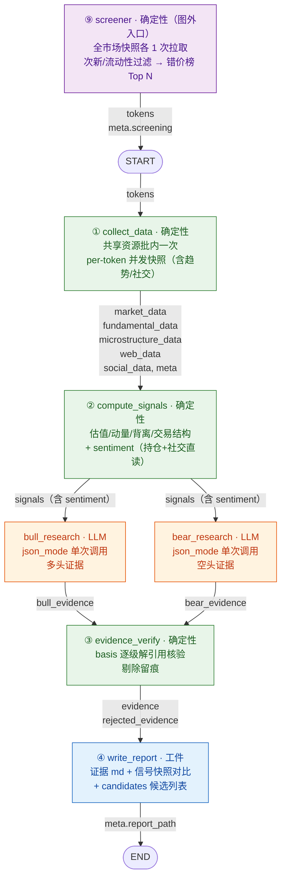

# 策略研究 Agent 架构（实施规格）

> 定位：从零构建的加密资产策略研究 Agent 项目完整实施规格。设计融合了**确定性信号层**（数值先算好再喂 LLM，可复现可回测）、**多空证据双分支**（bull/bear 并行陈列证据，互不可见）、**确定性证据核验**（basis 逐级解引用）与**可校验工件落盘**（证据清单 + 信号快照对比）。系统不产出任何方向性结论，由使用者依据证据自行裁决。
> 本文档为实施规格，可直接按第八节任务清单从空项目开始构建。
>
> 阅读顺序：项目结构（〇）→ 拓扑（一）→ State 数据字典（二）→ 节点规格（三）→ Prompt（四）→ 执行轨迹（五）→ 错误矩阵（六）→ 成本（七）→ 任务清单（八）→ 决策（九）→ 纪律（十）。

## 〇、项目结构与模块规划（从零构建清单）

**技术栈基线（已确认）**：Python 3.13（虚拟环境 `/home/lhh/pythonprojects/.venv`，实测解释器 3.13.5，依赖用 `uv pip` 管理；LangGraph + Binance 官方 SDK 在 3.13.5 上已实测通过）；图框架 **LangGraph + LangChain**（`create_react_agent` / `with_structured_output` / `with_retry`）；LLM = **DeepSeek deepseek-chat**（json_mode 走 `response_format=json_object` 通道，任务 9 冒烟验证）；行情数据 = **Binance 官方 SDK**（`binance-sdk-spot` / `binance-sdk-derivatives-trading-usds-futures` / `binance-common`，已实测：Python 3.13 导入与现货/合约端点直连全部通过，现货 `ticker24hr`、合约 `mark_price` / `ticker24hr_price_change_statistics` 均返回真实数据）；数据源 HTTP 其余部分（defillama/web）= **httpx**（sync 模式，与 ThreadPoolExecutor 兼容）；测试框架 **pytest**。

| 模块 | 职责 | 关键设计要点 |
| --- | --- | --- |
| `datasources/` | 免费数据源装配层 | `web.py`（Bing News RSS + Web RSS，零 key）、`defillama.py`、`binance.py`（**官方 SDK 薄适配**，含 `fetch_ticker_24h_all` 全市场 24hr ticker）、`binance_futures.py`（**官方 SDK 薄适配**，含微观结构端点：mark_price / openInterestHist / globalLongShortAccountRatio / topLongShortAccountRatio|PositionRatio / takerlongshortRatio / exchangeInfo（含 `fetch_listing_days` 全量 onboardDate））、`okx.py`（公开接口，爆仓 4h 序列 → 24h 多空爆仓额，**OKX 单所口径**）、`x_social.py`（X 公开主页零 key 抓取：粉丝数 + 近 30 条推文互动，页面原样文本 + `parse_compact_number` / `post_frequency_days`）、`mock.py`；SDK 调用模式：`Spot(config_rest_api=...).rest_api` 惰性单例 + `to_plain()` 解包（pydantic→dict）+ 429/418 权重限流退避（参考 BinanceApi 项目已验证的 `WeightBudget` 模式）；数据点一律 `{value, source, timestamp, confidence}` 包装；**失败即失败**：数据源失败该数据点标记 error/UNKNOWN，绝不回退 mock（mock 仅限 `SR_MOCK=1` 显式离线模式）；`SR_MOCK=1` 时零外部请求 |
| `screener.py` | 确定性币种筛选（图外入口） | 合约全市场 24hr ticker + exchangeInfo（含白名单：TRADING + PERPETUAL + USDT 计价 + 非稳定币 baseAsset）各 1 次拉取；规则引擎：Filter（次新 / 流动性下限 / 排除稳定币）AND 依次过滤 → Rank（错价榜 / 波动榜 / 涨跌榜 / 成交额榜）排序 → `sector_cap` 板块上限截断 → 取 Top N，零 LLM；`SR_TOKENS` 手动覆盖跳过筛选；快照失败抛 `ScreeningError` 批终止（全架构唯一允许终止的节点）；板块索引属辅助数据，失败只留痕不终止；mock 返回固定候选 |
| `signals.py` | 确定性信号计算 | 纯函数无 IO：`valuation_ratios` / `momentum_score` / `divergence` / `sentiment_raw`（12 项 components，含社交）/ `market_metrics`（rv/drawdown/α/β/turnover）/ `funding_percentile` / `funding_cross_sectional_pctile` / `oi_price_divergence` / `liquidation_imbalance` / `social_heat_trend` + `social_heat_window`（共用 `_heat_split` 分档）/ `social_price_divergence` / 趋势档；任何输入缺失 → `None`（UNKNOWN 纪律），绝不猜测 |
| `context.py` | 分支摘要与 Prompt（LLM 唯一输入面） | `BULL_PROMPT` / `BEAR_PROMPT`（json_mode）+ `build_branch_summary(symbol, state)`：确定性事实清单（信号/市场/基本面/微观结构/社交/新闻/扫描器快照/市场级环境），字段口径注记块（`_FIELD_NOTES`）内嵌防语义漂移；序列截断（新闻 ≤3、推文明细最近 `_POST_RENDER_CAP=10`）；**摘要即覆盖契约的一侧**——快照里有值却不进摘要的字段视为浪费（纪律 十-11） |
| `evidence.py` | 证据体系 | `EvidenceItem`（claim + basis{domain/field/value} + source，**无 confidence**）+ `BranchOutput`；`verify_evidence` 确定性核验纯函数（basis 逐级解引用 + 列表下标须在摘要中可见，剔除留痕） |
| `schemas.py` | 宽容 JSON 解析器 | `_extract_json`（代码块围栏 / 单引号键 / 尾部截断 / 未闭合括号逐级容错；不可解析 → None）；05 票：旧决策链 schema 退役，证据条目 schema 收敛至 evidence.py |
| 依赖 | langgraph / langchain（含 langchain-openai 适配 deepseek）/ httpx / binance-sdk-spot / binance-sdk-derivatives-trading-usds-futures / binance-common / pydantic / pytest | uv pip 安装进 `.venv` |
| `state.py` | 全局状态 | TypedDict 16 字段，后写覆盖语义（每字段每 symbol 恰好写一次，无 reducer）；字段来源 = 数据流 |
| `nodes.py` | 图节点 | 6 个节点（数据层 + 信号 + 两分支 + 核验 + 报告）；条件全在节点内部；批处理永不中断 |
| `graph.py` | 图组装 | `START → ①→②→[bull_research ‖ bear_research]→③→④ → END`，8 条边全实线（两分支并行 fan-out/fan-in），无条件路由 / Command / interrupt / checkpointer |
| `report.py` | 报告落盘 | `evidence.md` + `run.json` + `candidates.json` + `snapshot.json` + `signal_diff.json`；渲染异常仅记 meta 不中断 |
| `lookback.py` | 「信号 vs 价格」回看（图外离线工具） | 只读历史 `reports/*/run.json` 的 signals + 合约日 K，算无前视的 Spearman ρ 与三等分收益差；不进图、不进 State、不写工件、零 LLM；读数必带边界警告（自选择 / 窗口重叠 / 多重比较 / 无方向结论） |
| `main.py` | 入口 | 模式互斥二选一：`--tokens`/`SR_TOKENS` 手动指定（跳过筛选，`meta.screening.mode="manual"`）或 `screener.select_tokens()` 确定性筛选（`mode="auto"`）→ 建图；`SR_MOCK=1` 全离线回归 |

## 一、目标拓扑（编译期结构）：6 节点并行图，边上标注数据流



**编译期保证**：8 条边全实线直连，无条件边 / 无循环；两分支并行 fan-out/fan-in（无 reducer，各写各的字段 bull_evidence / bear_evidence，后写覆盖语义不变）——图编译永远成功。行为分化全部发生在节点内部（分支是否产出、核验是否剔除），不跨边路由。**⑨ 筛选器不在编译期图内**：它是 `main.py` 的入口装配（先选币、后建图），图仍 6 节点 8 条边，`tokens` 只是它的输出。

## 二、State 数据字典（字段级，标注数据域来源）

6 个证据/分支字段（`bull_evidence` / `bear_evidence` / `bull_errors` / `bear_errors` / `evidence` / `rejected_evidence`）全部**后写覆盖**（每 symbol 每节点恰好写一次），两分支各写各的字段（并行写共享键会触发 LangGraph 冲突），无需 reducer。

| State 字段 | 数据域 | 写入 | 读取 | 结构（嵌套到叶子） |
| --- | --- | --- | --- | --- |
| `tokens` | 输入（⑨ 筛选器产出） | — | 全部 | `list[str]`：⑨ 确定性筛选结果；`SR_TOKENS` 手动覆盖时跳过筛选 |
| `market_data` | 确定性层 | ① | ② 分支 ④ | `dict[symbol, {price, change_24h, quote_volume_24h, change_7d, change_30d, change_90d, change_1y, funding, funding_avg_7d, funding_trend, oi, basis, taker_buy_ratio_24h, listing_days, error, futures_error, incomplete}]`（数据点均 `{value, source, timestamp, confidence}` 包装） |
| `fundamental_data` | 确定性层 | ① | ② 分支 ④ | `dict[symbol, {kind, name, category, resolved, tvl, tvl_change_7d, tvl_change_30d, tvl_change_1d, mcap, fdv, fees_24h, fees_7d, revenue_24h, revenue_7d, stablecoin_supply, dex_volume_24h, tvl_trend_30d, fees_trend_30d, stablecoin_change_30d, error, incomplete}]`（趋势特征为确定性计算值） |
| **`microstructure_data`** | 确定性层 | ① | ② 分支 ④ | `dict[symbol, {oi_change_24h, oi_change_48h, oi_value_change_24h, ls_ratio_all, ls_ratio_all_change_24h, ls_ratio_top_acc, ls_ratio_top_pos, taker_bs_ratio_1h, liq_long_24h, liq_short_24h, liq_total_24h, liq_total_oi_ratio, liq_imbalance:{ratio,label,note}, oi_price_divergence:{label,note}, error, incomplete}]`（爆仓键 source=okx，其余 binance_futures） |
| `web_data` | 确定性层 + 新闻/催化剂 | ① | 分支 ④ | `dict[symbol, {symbol, items: list[{date,title,source}] \| None, web_error, incomplete}]` |
| **`social_data`** | 确定性层（X 有头浏览器抓取） | ① | 分支 ④ | `dict[symbol, {symbol, follower_count, posts: list[{likes,reposts,comments,views,time}] \| None, post_frequency, social_heat_trend, social_heat_window, social_price_divergence:{label,note}, error, incomplete}]`：互动数为**页面原样文本**（`"16.3万"`/`"14"`）不做归一化；`post_frequency` 天/条、`social_heat_trend` 热度变化 %、`social_heat_window` 为热度读数的样本档名（档名即算式，两档不可互比）均为确定性派生；抓取失败全字段 UNKNOWN |
| `signals` | 确定性层 + 情绪维度 | ② | 分支 ④ | `dict[symbol, {symbol, valuation:{value:{mc_fees,fdv_revenue,mc_tvl,fees_tvl}}, momentum:{value}, divergence:{value:{divergence_7d,divergence_30d,quadrant}}, sentiment:{components:{funding,funding_trend,funding_pctile_90d,funding_x_pctile,ls_ratio_all,ls_ratio_top_acc,ls_ratio_top_pos,taker_bs_ratio_1h,oi_change_24h,oi_price_divergence:{label,note},social_heat_trend,social_price_divergence:{label,note}}, note}, market_metrics:{value:{rv_7d,rv_30d,drawdown_1y,vol_adj_ret_7d,vol_adj_ret_30d,beta_30d,alpha_30d,turnover}}, error}]`（sentiment 为持仓指标原始直读，无阈值打分） |
| **`bull_evidence`** | 分支证据 | bull_research | ③ ④ | `dict[symbol, list[EvidenceItem]]`：`{claim, basis:{domain, field, value}, source}`，上限 15 条（prompt 第 9 条：按重要性降序、basis 三元组互不相同）（多头分支独占字段） |
| **`bear_evidence`** | 分支证据 | bear_research | ③ ④ | 同上（空头分支独占字段） |
| `bull_errors` / `bear_errors` | 分支留痕 | 分支节点 | ④ | `dict[symbol, str]`：分支异常消息（异常 → 该 token 该分支空清单，批不中断） |
| **`evidence`** | 证据体系 | ③ | ④ | `dict[symbol, {bull_case: list[EvidenceItem], bear_case: list[EvidenceItem]}]`：两分支核验通过产物的合并陈列 |
| **`rejected_evidence`** | 证据体系 | ③ | ④ | `dict[symbol, list[{claim, reason}]]`：核验剔除留痕（basis 解引用失败 / 值不一致），可审计 |
| **`research_artifacts`** | 工件层 | ④ | 输出工件 | `dict`：`{"candidates": list[str]}`（候选列表，全局工件；机会分级/流动性分层退役，spec D8） |
| `meta` | 各节点 | — | ④ | `dict`：`incomplete_tokens` / `screening`（筛选规则追踪：mode / rules / candidates；手动模式 `mode="manual"`）/ `report_path` / `llm_calls`（bull/bear 计数键 + total） |

**证据体系在数据层的映射**（多空证据陈列如何替代决策体系）：

| 参考角色 | 数据载体 | 说明 |
| --- | --- | --- |
| 多头证据研究员 | `bull_evidence` | 只找做多证据（增长/趋势/资金流入），输出带 basis 引用 |
| 空头证据研究员 | `bear_evidence` | 只找做空证据（估值/拥挤/风险），输出带 basis 引用 |
| 证据核验（机器强制） | `evidence` + `rejected_evidence` | basis 逐级解引用存在且值一致 → 通过；否则剔除留痕（LLM 无法覆盖，D8 决策） |
| 数据域（可扩展） | `basis.domain` | signals / market_data / fundamental_data / microstructure_data / web_data / social_data / market_env；新数据域 = 快照加域，分支零改动自动可见 |
| Bull/Bear 两面解读 | 两分支并行 | 同消费同一份冻结快照、互不可见——同一数据可被两分支引用为相反证据，分歧点并列呈现 |

**工件与宏观纪律在数据层的映射**：

| 参考工件 | 数据载体 | 说明 |
| --- | --- | --- |
| 候选清单 | `tokens` + `candidates.json` | ⑨ 筛选器产出；candidates.json 仅候选列表（机会分级/流动性分层退役，spec D8） |
| 证据陈列文档 | `evidence.md` | 顶部总览表（token / 多头证据数 / 空头证据数 / 数据域覆盖）+ 每 token 做多/做空两张表 + 剔除记录附录 |
| 信号驱动失效 | `snapshot.json` + `signal_diff.json` | 信号快照（quadrant / momentum / funding_pctile_90d / oi_price_divergence / 趋势特征 / 社交热度档）跨运行对比，action ∈ new/changed/unchanged；失效由周期性重跑检测信号反转 |

## 三、节点规格

### ⑨ screener — 确定性币种筛选（图外入口装配，零 LLM）

**定位**：`tokens` 不再手动枚举——`main.py` 装配顺序：`screener.select_tokens(rules, top_n)` → `graph.invoke({tokens, meta})`。筛选快照失败 = 无候选 = 无批，抛 `ScreeningError` 显式终止（**全架构唯一允许终止的节点**，区别于数据点失败不中断批：入口没有静默降级的意义）。

**签名**：`def select_tokens(rules: list[ScreenRule], top_n: int = 10, max_per_category: int = 3) -> ScreeningResult`

**数据来源（各 1 次全量请求，零 LLM；一律合约口径——候选只可能是 USDT 永续，用现货 ticker 会错配）**：
- `binance_futures.fetch_fapi_ticker_24h_all()`：`/fapi/v1/ticker/24hr` 全市场 → `{symbol, price_change_pct, quote_volume}`；失败返回 `None`
- `binance_futures.fetch_listing_days()`：`/fapi/v1/exchangeInfo` 全量 → `dict[symbol, listing_days]`（onboardDate 口径，与 `market_data.listing_days` 一致）；失败返回 `None`
- `binance_futures.fetch_exchange_info()`：白名单——仅保留 `status=TRADING` + `contractType=PERPETUAL` + USDT 计价 + baseAsset 非稳定币的交易对（排除 XAUUSDT/TSLAUSDT 等交割合约与 ETHBTC 等非规范 symbol）；失败返回 `None`
- `defillama.fetch_protocol_categories()`：`/lite/protocols2` → `dict[symbol, category]` 板块索引（约 6.7MB）；**仅 `max_per_category > 0` 时请求**，关闭约束零开销；对 Binance 永续的覆盖率约四成（未命中即无标签）

**规则引擎**（可配置、可组合、确定性；Filter 依次 AND 过滤 → 单一 Rank 排序 → `sector_cap` 截断 → 截取 top_n）：

| 类别 | 规则 | 参数 | 语义 |
| --- | --- | --- | --- |
| Filter | `listing_days_lt` | `max_days=100` | 次新：合约上线 ≤100 天 |
| Filter | `min_quote_volume` | `min_quote_volume=1e7` | 流动性下限（24h 成交额） |
| Filter | `exclude_stablecoins` | — | 排除 USDT/USDC/FDUSD/TUSD 等计价稳定币（symbol 后缀） |
| Rank | `mispricing_24h` | `top_n=10` | 错价榜：24h 涨跌幅升序排名 + 成交额降序排名等权合成（价格弱 + 成交活跃优先，用户默认） |
| Rank | `volatility_24h` | `top_n=10, abs=True` | \|24h 涨跌幅\| 降序（波动榜） |
| Rank | `gain_24h` / `loss_24h` | `top_n=10` | 单边涨 / 单边跌榜 |
| Rank | `quote_volume` | `top_n=10` | 成交额榜 |
| Cap | `sector_cap`（内置后处理，非注册表规则） | `max_per_category=3`（`0` = 关闭） | 排序后按板块截断：同板块超额者让位给后续名次的异板块候选——整批挤在同一叙事时两分支采到的证据面同质（实测同板块两币同时进批）；无板块标签者各自成桶不受罚（UNKNOWN 纪律） |

用户示例“上交易所 100 天以内的币，24h 波动最大前 10”= `[listing_days_lt(100), min_quote_volume(1e7), exclude_stablecoins] + volatility_24h(top_n=10)`；默认错价榜 = `[listing_days_lt(100), min_quote_volume(1e7), exclude_stablecoins] + mispricing_24h(top_n=10)`。

**伪代码**：

```python
# screener.py —— 纯确定性，无 IO 副作用集中在两个 fetch
@dataclass
class ScreenRule:
    kind: str  # "filter" | "rank"
    name: str  # 注册表 key，如 listing_days_lt
    params: dict = field(default_factory=dict)


def select_tokens(rules: list[ScreenRule], top_n: int = 10) -> ScreeningResult:
    if is_mock_mode():
        return ScreeningResult(
            mode="mock",
            rules=describe(rules),
            candidates=[
                {"symbol": s, "reason": "mock 固定候选", "metrics": {}}
                for s in ["BTC", "ETH", "SOL", "UNI", "DOGE", "XRP"]
            ],
        )
    tickers = binance.fetch_ticker_24h_all()  # 失败返回 None
    listing = binance_futures.fetch_listing_days()
    if tickers is None or listing is None:
        raise ScreeningError("全市场快照拉取失败，批终止（失败即失败，不回退 mock）")
    rows = [
        {
            "symbol": t["symbol"],
            "price_change_pct": t["price_change_pct"],
            "quote_volume": t["quote_volume"],
            "listing_days": listing.get(t["symbol"], UNKNOWN),
        }
        for t in tickers
    ]  # 缺失字段标 UNKNOWN，规则保守排除
    for f in (r for r in rules if r.kind == "filter"):  # AND 依次过滤
        rows = FILTERS[f.name](f.params).apply(rows)
    rank_rules = [r for r in rules if r.kind == "rank"]
    rows = (
        RANKERS[rank_rules[0].name].apply(rows) if rank_rules else rows
    )  # 无 rank 规则时跳过排序（防 StopIteration）
    return ScreeningResult(
        mode="auto", rules=describe(rules), candidates=rows[:top_n]
    )  # 每条带 reason（命中规则 + 指标值）
```

**失败矩阵**：

| 失败类型 | 处理 |
| --- | --- |
| 全量快照拉取失败（网络/5xx/解析） | `ScreeningError` 抛给 `main`，批终止、显式报错；不回退 mock、不静默产出空批 |
| 单条 symbol 字段缺失 | 该行标 UNKNOWN，规则对 UNKNOWN 保守排除（如 `listing_days_lt` 对 UNKNOWN 不通过） |
| 板块索引拉取失败 / 返回空 | **辅助数据，不终止批**：`sector_cap` 不生效（按纯排序取 top_n），`meta.screening.rules` 追加「sector_cap 未生效：板块索引不可用」留痕；让位条数同样写进 rules |

**输出**：`tokens`（图输入）+ `meta.screening`（`mode / rules / candidates[{symbol, reason, metrics, category}]`，④ 渲染“币种筛选”节，报告可审计“为什么选这 N 个”；`category` 为板块标签（索引未命中 → `None`，不伪造标签），同时以 `板块=xxx` 附在 `reason` 尾部，并渲染进分支摘要的 `fundamental` 段供两分支消费）。

### ① collect_data — 确定性数据收集

**签名**：`def collect_data(state: dict) -> dict`

**处理步骤**：
1. `SR_MOCK=1` 时共享资源全部跳过（零外部请求），per-token 装配层各自走 mock。
2. 真实模式：共享资源**批内只拉一次**——DeFiLlama 协议/链列表、Binance tickers、fapi 全量索引（premium/price）、聚合表（按 token 类型按需：protocol 类拉 fees，chain 类拉 stablecoins/dexs）。
3. per-token 并发快照（`ThreadPoolExecutor(max_workers=4)`）：基本面 + 市场 + 衍生品（并入 market 快照，`futures_error` 独立标记）+ 聚合字段（并入 fund 快照）+ Web 新闻（独立 state key）。
4. **失败即失败**：各步 try 包裹，数据源失败即标记 `error`（该数据点 UNKNOWN），**绝不回退 mock 数据**（mock 仅限 `SR_MOCK=1` 显式离线模式）；不中断整批。
5. per-token 微观结构装配（写入 `microstructure_data`）：OI 变化 24h/48h 与 OI 名义额变化（openInterestHist，96 个 1h 点）、全市场多空账户比 + 24h 变化（globalLongShortAccountRatio）、大户多空账户/持仓比（topLongShortAccountRatio / topLongShortPositionRatio）、官方 taker 买卖比（takerlongshortRatio，`taker_bs_ratio_1h` 按量加权）；`taker_buy_ratio_24h` / `listing_days`（exchangeInfo 合约上线时间）并入 market 快照。
6. per-token 爆仓装配（并入 `microstructure_data`，OKX 公开接口单所口径，`source=okx`）：24h 多头/空头/总爆仓额（`liq_long_24h` / `liq_short_24h` / `liq_total_24h`）、爆仓额相对 OI 比例（`liq_total_oi_ratio`）、爆仓失衡档（`liq_imbalance` = `{label, ratio, note}`，ratio = 多头爆仓额 / 空头爆仓额）；OKX 常态缺失，不计入 `incomplete`。
7. per-token 社交装配（写入 `social_data`，X 公开主页抓取，`source=x_social`）：粉丝数 `follower_count` 与近 30 条推文 `posts[i]`（`likes`/`reposts`/`comments`/`views`/`time`，**页面原样文本**如 `16.3万`，不做归一化）；确定性派生三件（signals 纯函数，与 `oi_price_divergence` 同构）——发帖频率 `post_frequency`（天/条，推文相对时间跨度）、社交热度趋势 `social_heat_trend`（互动强度 = likes+reposts+comments，views 只算触达不计入；样本分档见 ②）、社交/价格背离 `social_price_divergence`（`{label, note}`，价涨热度升=confirm_long 等四态）；抓取失败全字段 UNKNOWN 且 `incomplete=True`。
8. `meta.incomplete_tokens` 汇总数据不完整 token 清单（含失败原因）。

**输出**：`market_data` / `fundamental_data` / `microstructure_data` / `web_data` / `social_data` / `meta`

**伪代码**：

```python
def collect_data(state: dict) -> dict:
    tokens = state["tokens"]
    meta = dict(state.get("meta") or {})
    if is_mock_mode():
        protocols = chains = tickers = premium_map = price_map = None
        tickers_ok = futures_ok = False
        aggregates = {"fees": None, "stablecoins": None, "dexs": None}
    else:
        protocols = defillama.fetch_protocols()  # 批内一次
        chains = defillama.fetch_chains()
        tickers = binance.fetch_all_tickers(tokens)
        tickers_ok = bool(tickers)
        premium_map = binance_futures.fetch_premium_index()
        price_map = binance_futures.fetch_fapi_prices()
        futures_ok = bool(premium_map)
        need_fees = any(
            not str(defillama.TOKEN_SLUG_MAP.get(t, "")).startswith("chain:")
            for t in tokens
        )
        need_chain = any(
            str(defillama.TOKEN_SLUG_MAP.get(t, "")).startswith("chain:")
            for t in tokens
        )
        aggregates = {
            "fees": defillama.fetch_fees() if need_fees else None,
            "stablecoins": defillama.fetch_stablecoins() if need_chain else None,
            "dexs": defillama.fetch_dexs() if need_chain else None,
        }

    def _one(symbol: str) -> tuple[str, dict, dict, dict]:
        # 基本面 / 市场 / 衍生品 / 微观结构 / 聚合 / Web 各步 try 隔离：失败即失败（error/UNKNOWN），不回退 mock
        ...
        return symbol, fund, mkt, web_snap

    market_data: dict[str, dict] = {}
    fundamental_data: dict[str, dict] = {}
    web_data: dict[str, dict] = {}
    incomplete: list[str] = []
    with ThreadPoolExecutor(max_workers=4) as pool:
        for symbol, fund, mkt, web_snap in pool.map(_one, tokens):
            market_data[symbol], fundamental_data[symbol], web_data[symbol] = (
                mkt,
                fund,
                web_snap,
            )
            if (
                fund.get("incomplete")
                or mkt.get("incomplete")
                or web_snap.get("incomplete")
            ):
                incomplete.append(symbol)
    meta["incomplete_tokens"] = incomplete
    return {
        "market_data": market_data,
        "fundamental_data": fundamental_data,
        "web_data": web_data,
        "meta": meta,
    }
```

### ② compute_signals — 确定性信号计算（含情绪维度）

**签名**：`def compute_signals(state: dict) -> dict`

**处理步骤**：per-token 调用 5 个纯函数（`sentiment_raw` 输入 = market + microstructure + social；`market_metrics` 输入 = fund + market）；mock 模式走 `mock.mock_signals_data(symbol, kind)`（同构字段）；单 token 异常置 `signals[symbol] = {error}` 不阻断。

纯函数（全部无 IO、可单测、输入缺失 → None）：

```python
def valuation_ratios(fund: dict | None, mkt: dict | None) -> dict:
    """估值比率（年化口径）：mc_fees / fdv_revenue / mc_tvl / fees_tvl。
    fees/revenue 用 24h 值 ×365 年化；chain 类无 mcap/fdv/fees → 自然 None。"""


def momentum_score(fund: dict | None) -> dict:
    """基本面动量分：tvl_change_7d / tvl_change_30d 各 0.5 权重加权均值（%）。"""


def divergence(fund: dict | None, mkt: dict | None) -> dict:
    """背离：divergence = 基本面增速 - 价格涨幅；四象限 I(双强)/II(弱基本强价格)
    /III(强基本弱价格，潜在做多候选)/IV(双弱)；任一缺失 → quadrant=None。"""


def market_metrics(fund: dict | None, mkt: dict | None) -> dict:
    """交易结构/风险派生（纯数值，进快照）：rv_7d / rv_30d / drawdown_1y /
    vol_adj_ret_7d / vol_adj_ret_30d / beta_30d / alpha_30d / turnover。"""


def social_heat_trend(posts: list[dict] | None) -> float | None:
    """社交热度变化 %：近期侧互动强度均值 / 更早侧中位数 - 1（中位数抗单条爆款脉冲）。
    样本分档（`_heat_split` 单一来源，与 social_heat_window 共用）：≥7 条 = 最近 5
    vs 其余中位数；恰 6 条 = 3 vs 3；<6 条不派生 → None。
    档数不同源不可跨比——档名由 social_heat_window 一并落快照。"""


def social_heat_window(posts: list[dict] | None) -> str | None:
    """热度读数的样本档名：recent5_vs_prior_median / recent3_vs_prior3_median；
    样本不足 → None（与 social_heat_trend 同步为 None，不留无档名的裸数值）。"""


def social_price_divergence(price_ret, heat_trend) -> dict | None:
    """社交/价格背离四态：confirm_long / weak_long / weak_short / confirm_short
    （+ 零值 none）；与 oi_price_divergence 同构，输入缺失 → None。"""


def sentiment_raw(mkt: dict | None, ms: dict | None = None, soc: dict | None = None) -> dict:
    """情绪维度：持仓/社交指标原始值直读，不做阈值加减分。
    阈值离散化会丢失信息（连续值压成 ±0.25 三档），且下游 LLM 按 prompt 规则直接解读原始值。
    输出 {components, note}；输入缺失的字段 → None（UNKNOWN 纪律）。
    """
    comp = {
        "funding", "funding_pctile_90d", "funding_trend",
        "ls_ratio_all", "ls_ratio_top_acc", "ls_ratio_top_pos",
        "taker_bs_ratio_1h", "oi_change_24h", "oi_price_divergence",
        "funding_x_pctile", "social_heat_trend", "social_price_divergence",
    }  # 12 项，均 _v(域, key) 直读；soc 为 social_data 快照
    return {"components": comp, "note": SENTIMENT_NOTE}
```

`compute_signals` 节点：`signals[symbol] = {"symbol", "valuation", "momentum", "divergence", "sentiment", "market_metrics", "error"}`（`ms = state["microstructure_data"][symbol]`、`soc = state["social_data"][symbol]`）。

### bull_research / bear_research — 证据分支（LLM，并行）

**签名**：`def bull_research(state: dict) -> dict` / `def bear_research(state: dict) -> dict`（共用模板 `_branch(state, side, key)`）

**输入**（只读，两分支同时消费同一份冻结快照）：`tokens` / `signals`（含 sentiment）/ 五快照

**处理步骤**（每分支对每个 symbol 串行，两分支之间互不可见）:
1. 构建分支摘要 `build_branch_summary(symbol, state)`：确定性快照压缩——数字 + 变化率 + source 标签（含微观结构、社交节），缺失一律 UNKNOWN，新闻 ≤3 条、推文明细最近 10 条（`_POST_RENDER_CAP`）；末尾追加指令行"只提取证据，禁止结论"。两分支共用同一份摘要（prompt 侧重引导：多头提示优先关注增长/趋势/资金流入，空头提示优先关注估值/拥挤/风险，无硬数据边界）。
2. 单次 json_mode 调用：`get_llm(json_mode=True).with_retry(stop_after_attempt=2).invoke(...)`（分支不带工具），callbacks 挂 `live_call_counter(side)` 计数。
3. `_extract_json` 取 `{evidence: [...]}`；逐条 `EvidenceItem.model_validate`，坏条目（claim/source 空）丢弃在装配层。
4. 条数上限 15 条（prompt 第 9 条：按重要性降序，每条 basis 三元组互不相同——重复引用由去重与 ③ 核验拦截）；单 token 异常 → 空清单 + `{side}_errors[symbol]` 留痕，批不中断。
5. 只写本分支独占字段（`bull_evidence` / `bull_errors` 或 `bear_evidence` / `bear_errors`）——并行写共享键（meta 等）会触发 LangGraph 冲突；`node_order` 由串行的 evidence_verify 统一记录。

**Schema（证据契约，spec 决策 4）**：

```python
class EvidenceItem(BaseModel):
    """一条结构化证据：claim + basis 三元组 + source（无 confidence——LLM 自评信心分是主观臆想）"""

    claim: str = Field(default="", description="主张（自由文本）")
    basis: Basis = Field(default_factory=Basis)  # domain / field / value
    source: str = Field(default="", description="与 basis.domain 一致")


class BranchOutput(BaseModel):
    evidence: list[EvidenceItem] = Field(default_factory=list)  # 按重要性降序，数量不设上限
```

**失败矩阵**：LLM 异常/解析失败 → 该 token 该分支空清单 + errors 留痕；全批继续；两分支互不影响。

**伪代码**：

```python
def _branch(state: dict, side: str, key: str) -> dict:
    errors: dict[str, str] = {}
    items: dict[str, list[dict]] = {}
    for s in state["tokens"]:
        got, err = _invoke_branch(s, state, side)  # json_mode 单次 + 宽容解析 + 坏条目丢弃
        items[s] = got
        if err:
            errors[s] = err
    out: dict[str, Any] = {f"{side}_evidence": items}
    if errors:
        out[f"{side}_errors"] = errors
    return out


def bull_research(state: dict) -> dict:
    return _branch(state, "bull", "bull_research")


def bear_research(state: dict) -> dict:
    return _branch(state, "bear", "bear_research")
```

### ③ evidence_verify — 确定性证据核验（机器强制位置）

**签名**：`def evidence_verify(state: dict) -> dict`

**处理步骤**（纯函数，无 IO）：
1. 合并两分支产物：`verify_evidence(bull_evidence, bear_evidence, state)`。
2. 逐条核验：`snapshot[domain][symbol][field]` 逐级解引用**存在**，且规范化后与 `value` **一致** → 通过；否则剔除并留痕（`{claim, reason}`）到 `rejected_evidence`。
3. **下标可见性检查**（`_invisible_index`）：`field` 中的每个 `[i]` 段必须出现在该 token 的分支摘要里（摘要与 LLM 所见同源，每 token 构建一次）。摘要对序列有截断（新闻 ≤3 条、推文明细最近 `_POST_RENDER_CAP=10` 条），核验却按 state 全量解引用——不校验下标，LLM 引用一条从未见过的早期推文、数值碰巧对上就能过关，等于允许凭空编造。
4. 通过产物按 `bull_case` / `bear_case` 归位写入 `evidence[symbol]`。
5. 串行节点补记分支 node_order（并行分支不写共享 meta，顺序即图定义顺序）。

**失败矩阵**：纯函数无 IO；branch 产物缺失 → 按空清单核验；domain 未知 / 字段缺失 / 下标未渲染 / 值不一致 → 剔除留痕。

**伪代码**：

```python
def evidence_verify(state: dict) -> dict:
    meta, order = _meta(state)
    order += ["bull_research", "bear_research", "evidence_verify"]
    meta["node_order"] = order
    verified, rejected = ev_mod.verify_evidence(
        state.get("bull_evidence"), state.get("bear_evidence"), state
    )
    return {"evidence": verified, "rejected_evidence": rejected, "meta": meta}
```

### ④ write_report — 工件产出（证据陈列 + 信号快照，overview.md 退役）

**定位**：全部确定性组装（无 LLM）。单证据文档 `evidence.md` + `run.json` + `candidates.json` + 信号快照/对比。系统不产出任何方向性结论，由使用者依据证据自行裁决（spec D7/D8）。

- **`research_artifacts`（candidates 工件，确定性派生，LLM 不可改）**：

```python
def _build_artifacts(state: dict) -> dict:
    """candidates 工件（04 票简化）：仅候选列表（机会分级/流动性分层退役，spec D8）。"""
    return {"candidates": list(state["tokens"])}
```

- **run.json 五要素**（`reports/<ts>/`，渲染异常仅记 `meta.report_error` 不中断批）：
  - `meta`：run_ts / mode / tokens / screening（筛选规则追踪，手动模式 `mode="manual"`）/ node_order / llm_calls（bull/bear 计数键 + total）；
  - `evidence`：每 token `{bull_case, bear_case}` 两分支核验通过产物（证据清单全量入 run.json）；
  - `rejected_evidence`：核验剔除留痕（claim + reason，可审计）；
  - `data_snapshot`：每 token 各数据域轻量投影（证据可复核的原始数据）；
  - `signals`：确定性信号快照投影（见下）。
- **落盘工件**（`reports/<ts>/` + `reports/latest/` 软链）：`evidence.md`（顶部总览表 token/多头证据数/空头证据数/数据域覆盖 + 每 token `### 做多证据`/`### 做空证据` 两张表 `# | claim | basis | source` + 文档末尾“剔除记录”附录；overview.md 退役）+ `candidates.json`（仅候选列表）+ `snapshot.json` / `signal_diff.json`（latest）。
- **信号快照与对比（信号驱动失效，替代价格锚点/有效期）**：
  - 快照：写 `reports/latest/snapshot.json` = `{run_ts, mode, tokens, signals: {symbol: {…}}}`，每 token 的键集合即 `report._SNAPSHOT_KEYS`（28 项：`quadrant` / `momentum` / `rv_7d` / `rv_30d` / `drawdown_1y` / `turnover` / `vol_adj_ret_7d` / `vol_adj_ret_30d` / `funding_pctile_90d` / `funding_x_pctile` / `funding_interval_hours` / `funding_carry_7d_pct` / `funding_carry_30d_pct` / `spread_pct` / `bid_depth_usd_2pct` / `ask_depth_usd_2pct` / `depth_band_state` / `liq_imbalance` / `oi_price_divergence` / `alpha_30d` / `beta_30d` / `tvl_trend_30d` / `fees_trend_30d` / `stablecoin_change_30d` / `social_heat_trend` / `social_heat_window` / `post_frequency` / `social_price_divergence`）——先读旧快照为 `prev` 再覆盖（历史运行在 `reports/<ts>/`）；原 `funding_z`（4 主币 z 分）与 `alpha_7d` / `beta_7d`（n=7 噪声）退役；
  - 对比：`signal_diff = {symbol: {prev, cur, action}}`，action 规则：prev 缺失 → `new`；信号全字段一致 → `unchanged`；任一字段变化 → `changed`（decision 型 `stop_short`/`stop_long` 退役，spec D8）；
  - 输出：`reports/latest/signal_diff.json`（脚本/自动化消费）；首次运行无 prev，全 `new`；
  - 失效语义：无价格锚点、无有效期——失效由外部调度（cron/手动）周期性重跑检测信号反转实现。
- 失败语义：异常仅记 `meta.report_error`（快照/对比失败不中断批）。

### ⑩ lookback — 「信号 vs 价格」回看评估器（图外、只读、零 LLM）

**定位**：系统不产方向结论（ADR 0001），但**信号的历史预测力是一个可描述的事实**，值得离线度量而不必让管线承担结论职责。`lookback.py` 因此不进图、不占 State、不写任何工件——只读历史 `reports/*/run.json` 的 `signals` 投影 + 合约日 K，打印描述性读数到 stdout。它回答的是「这组数字过去一起怎么动」，永远不回答「该做多还是做空」。

**签名**：`def main(argv=None, fetch=binance_futures.fetch_fapi_klines, now=None) -> dict`（CLI `python -m strategy_research.lookback [--root reports] [--horizons 1,3,7,14] [--json]`；`fetch`/`now` 注入仅为可测与可复现）。

**口径（缺一不可）**：

| 规则 | 语义 |
| --- | --- |
| 无前视 | 基准价与前视收益一律走 `binance.closed_daily_returns`：基准 = 决策时点最近**已收盘**日线，前视只取基准之后的日 K；快照不必记价格（不改 schema） |
| 窗口须已收盘 | `run_ts + N` 日尚未走完 → 该 `(run, horizon)` 不采并 warn；否则 `ret_1d` 指向正在形成的日 K，相隔几分钟的两次运行给出两个不同读数 |
| 只采 live | `mode=mock` 的 run 价格与时间不具真实性，跳过并 warn |
| 同日去重 | 同一 UTC 日多次运行只取首次——否则 1 个观测按 2 个计（仓库实测 8/25、8/27 各有一对相隔数分钟的运行） |
| UNKNOWN 纪律 | 值为 `None` 或分类字符串（`quadrant` / `label` / `depth_band_state`）→ 该字段整列不参与秩相关，不编码、不填充 |
| 超额口径 | 标的收益 − 同期 BTC 收益（同基准日规则），剥掉市场整体波动这一混淆项；BTC 缺失时该样本只计原始收益 |
| 只评估当前信号集 | 键集合限 `_SNAPSHOT_KEYS`；历史 run 携带的退役字段（`funding_z` / `alpha_7d` / `beta_7d`）不静默丢弃，单列为「schema 漂移」警告 |

**统计量**：Spearman 秩相关 ρ（并列取平均秩，`n<3` 或零方差 → `None`）+ 三等分分组平均收益差（top − bottom）；门槛 `MIN_CORR_N=6`、`MIN_GROUP_N=9`，未达门槛仍计算但标注「读数无统计意义」。

**输出边界**：markdown 读数头部固定四条读数边界（选币自选择 / 窗口重叠 / 多重比较 / 无方向结论）——**警告与读数同等重要**，缺了警告的 ρ 会被读成结论。

**失败语义**：目录缺 `run.json` / JSON 损坏 / 非 live → 跳过该 run 并 warn，不中断整个评估；本模块任何路径都不写文件（单测以 `rglob` 名单不变来钉住只读承诺）。


## 四、Prompt 规格（全文）

两分支 prompt 结构相同：角色定义 + 共同规则（`_BRANCH_RULES` 1–6 + `_BRANCH_OUTPUT` 7–10，`_BRANCH_RULES` 尾部与 `_BRANCH_OUTPUT` 头部拼成第 6 条「只提取{多头|空头}视角证据…」）+ 输出契约，全部收敛在 `context.py` 一处定义（05 票：FACTS/DECIDE/CHALLENGE/FINALIZE 四 prompt 退役，仅存分支证据链）。多空 prompt **仅两行不同**：首行角色、第 6 条视角词。分支不带工具（单次 json_mode 结构化输出，`with_retry(stop_after_attempt=2)` + 宽容解析 + 坏条目丢弃）。

**system 消息全文**（`{多头|空头}` 处为唯一分歧）：

```
你是一名{多头|空头}证据研究员。基于给定数据，列出支持{做多|做空}该资产的结构化证据条目。
严格遵守：
1. 严禁编造：claim 与 basis 只能引用输入数据中的既有字段与数值；缺失写 UNKNOWN，禁止猜测。
2. 每条证据必须包含：claim（主张）、basis（结构化数据引用三元组：domain 数据域 / field 点号路径 / value 引用时点的快照值，逐字来自输入）、source（与 basis.domain 一致）。
3. basis.domain 只能取数据域白名单之一：signals / market_data / fundamental_data / microstructure_data / web_data / social_data / market_env；禁止使用数据源名（binance / binance_futures / defillama / bing / x_social 等）或节标题（市场/基本面/新闻/社交）作为 domain。
4. basis.field 必须引用到输入中的标量层（含 .value 后缀），如 momentum.value、divergence.value.quadrant、sentiment.components.funding、tvl.value、oi_change_24h.value；社交节推文序列为裸字段（posts[i].likes，无 .value 后缀，i 只能取摘要中实际出现过的下标，禁止引用未渲染的更早推文）。
5. basis.value 必须逐字引用输入中该字段的显示值，禁止改写、重算或四舍五入。
6. 只提取{多头|空头}视角证据，禁止给出决策、结论或建议（那是后续决策者的工作）。
7. claim 中出现的每个数值必须来自其 basis 引用的字段（允许该字段的派生表述），禁止把其他字段的数值归因到本字段（如把全账户多空比变化说成顶级账户变化），禁止使用输入中不存在的计算值（如比率换算、合成指标）。
8. 每条证据必须引用与已有条目不同的数据点（basis 三元组不同）；禁止把同一事实改写为多条证据凑数（如同一数值换 claim 表述重复引用）。
9. 数量上限 15 条，按重要性降序，只保留最重要的独立事实。
10. 输出 JSON：{"evidence": [{"claim": "...", "basis": {"domain": "...", "field": "...", "value": "..."}, "source": "..."}]}。
```

**human 消息 = `context.build_branch_summary(symbol, state)`**（LLM 唯一的知识面）：确定性事实清单按节渲染——信号节（valuation/momentum/divergence/sentiment components/market_metrics）、市场节、基本面节（含 `tvl_trend_30d` / `fees_trend_30d` / `stablecoin_change_30d`）、微观结构节（OI/多空比/taker/爆仓 `liq_imbalance` 含 ratio）、社交节（粉丝数、`post_frequency`、`social_heat_trend` + `social_heat_window` 档名、`social_price_divergence`、推文最近 10 条明细）、新闻节（≤3 条）、扫描器快照节、市场级环境节，末尾附「字段口径」注记块（`_FIELD_NOTES`）。mock 全字段摘要实测约 126 行 / 6k 字符；摘要内出现的字段名与快照有值字段由覆盖契约测试逐一对账（纪律 十-11），第 4 条的下标可见性由 `evidence_verify` 机器复核（不再只靠 prompt 自觉）。

## 五、运行时行为：一次 6-token 批的执行轨迹

两分支并行、执行分化。示例批 `[BTC, ETH, SOL, UNI, DOGE, XRP]` 由 ⑨ 筛选器产出（`meta.screening` 记录规则与候选理由；`SR_TOKENS` 可手动覆盖）：

| 节点 | BTC | ETH | SOL | UNI | DOGE | XRP | 本节点 LLM 调用 |
| --- | --- | --- | --- | --- | --- | --- | --- |
| ① collect_data | 并发快照（确定性，0 LLM） | 同左 | 同左 | 同左 | 同左 | 同左 | 0 |
| ② compute_signals | 确定性信号（0 LLM） | 同左 | 同左 | 同左 | 同左 | 同左 | 0 |
| bull_research | json_mode | json_mode | json_mode | json_mode | json_mode | json_mode | 6 |
| bear_research | json_mode | json_mode | json_mode | json_mode | json_mode | json_mode | 6 |
| ③ evidence_verify | 确定性核验（0 LLM） | 同左 | 同左 | 同左 | 同左 | 同左 | 0 |
| ④ write_report | 工件落盘（0 LLM） | 同左 | 同左 | 同左 | 同左 | 同左 | 0 |
| 合计 | ≈2 | ≈2 | ≈2 | ≈2 | ≈2 | ≈2 | **12，人均 2** |

关键观察：
- **每 token 恰好 2 次 LLM 调用**（bull + bear 各 1 次 json_mode），无 PASS 透传——两分支对每个 token 都独立收集证据，成本结构简单可预期；
- 两分支**并行执行**（fan-out/fan-in，无 reducer），同消费同一份冻结快照、互不可见——同一数据可被两分支引用为相反证据，分歧点并列呈现；
- 分支失败（单 token 异常）→ 该 token 该分支空清单 + `bull_errors`/`bear_errors` 留痕，批不中断（spec D13）；
- ③ 核验剔除的坏证据进 `rejected_evidence`，④ 工件永远反映核验后的状态——**证据客观性由机器强制，LLM 无法覆盖**。

## 六、错误处理矩阵（汇总）

| 节点 | 失败类型 | 处理 | 是否中断批 |
| --- | --- | --- | --- |
| ⑨ screener（入口） | 全量快照拉取失败（网络/5xx/解析） | `ScreeningError` 显式报错，**批终止**（无候选无批；不回退 mock、不静默产出空批） | 是（唯一） |
| ① collect_data | 数据源失败（端点 5xx/超时/解析失败） | **失败即失败**：该数据点标 error/UNKNOWN，**不回退 mock**；token 继续（分支按 UNKNOWN 处理） | 否 |
| ② compute_signals | 输入缺失 | 对应信号 None（UNKNOWN 纪律） | 否 |
| bull_research / bear_research | LLM 异常 / 解析失败 / 坏条目 | 该 token 该分支空清单 + error 留痕（`bull_errors`/`bear_errors`），另一分支不受影响 | 否 |
| ③ evidence_verify | basis 解引用失败 / 值不一致 / 下标未渲染 / claim 数值无出处 | 该证据剔除并留痕（rejected_evidence） | 否 |
| ④ write_report | 落盘异常 | 记 `meta.report_error` | 否 |
| 任何节点 | 单 token 异常 | 节点级 try 隔离，仅该 token 标 error/UNKNOWN，不影响其余 token | 否 |

**不变式**：批处理永不中断；所有 LLM 异常路径都有确定性结果（空清单 / 空对象），报告与工件永远可生成。

## 七、成本明细（消息级）

| 路径 | 组成 | LLM 调用次数 | 说明 |
| --- | --- | --- | --- |
| 筛选层（⑨，批入口） | 全量 REST 2 次（合约 24hr ticker + exchangeInfo），`max_per_category>0` 时另加 1 次 DefiLlama `/lite/protocols2` | **0** | 图外确定性代码；只随批一次，不按 token 计 |
| 每 token | bull_research json_mode + bear_research json_mode | **2** | 两分支各 1 次结构化输出，固定成本 |
| 全批 6 token | — | **12** | 与 token 数线性，无透传/轮次差异 |

成本结构优势：**成本可预期、与批内容无关**——每 token 恰好 2 次调用（旧决策链 PASS 2 次 / TRADE-WATCH 4-7 次的不确定性消除）。两分支都是单次 json_mode（无工具轮）；`with_retry(stop_after_attempt=2)` 的重试计入 `llm_calls` 统计（bull/bear 计数键 + total），mock/live 双路径计数保留。每次调用的输入面是同一份分支摘要，实测约 126 行 / 6k 字符（含推文最近 10 条明细与「字段口径」注记块）——把数据喂给 LLM 的成本在这里，「抓了不喂」的成本则是白付一次外部请求。

## 八、实施任务清单（TDD 顺序，从空项目开始）

> 验收标准即“完成定义”。每步跑 mock 回归（`SR_MOCK=1`，全离线），第 15 步端到端全量验证。

| # | 任务 | 文件 | 验收 |
| --- | --- | --- | --- |
| 1 | 项目骨架：`__init__.py`、`main.py` 入口、`.env.example`、依赖清单 | 根目录 | `python -m strategy_research.graph` 占位可运行 |
| 2 | `datasources/`：defillama / binance / binance_futures（含 openInterestHist / globalLongShortAccountRatio / takerlongshortRatio / exchangeInfo 微观结构端点）/ okx（爆仓）/ x_social（X 公开主页）/ web / mock | `datasources/` | mock 模式零外部请求；真实模式各端点冒烟可用（官方 SDK 已实测直连）；**失败即失败**：注入断网后数据点=error/UNKNOWN，零 mock 数据混入；数据点四元组包装 |
| 3 | `screener.py`：规则引擎（Filter/Rank 注册表）+ `select_tokens` + mock 固定候选 | `screener.py` | 单测：次新过滤 / 错价榜与波动榜排序 / 稳定币排除 / 快照失败抛 `ScreeningError`；mock 返回固定 6 候选；`SR_TOKENS` 覆盖跳过筛选 |
| 4 | `signals.py` 纯函数集（估值 / 动量 / 背离 / sentiment_raw / market_metrics / 费率分位 / OI 与社交背离 / 热度分档）+ `compute_signals` 节点雏形 | `signals.py` | 单测：各函数 3 种输入（正常/缺失/异常）；缺失→None |
| 5 | `schemas.py`：宽容 JSON 解析器（`_extract_json` 系列） | `schemas.py` | 代码块围栏 / 单引号键 / 尾部截断 / 未闭合括号容错；不可解析 → None |
| 6 | `context.py`：BULL/BEAR 分支 prompt + 分支摘要构建器 + 情绪解读注记（单一来源） | `context.py` | 覆盖契约测试（`tests/test_data_coverage.py`）：快照有值字段必进摘要或显式隐藏白名单；缺失字段渲染 UNKNOWN |
| 7 | `evidence.py`：EvidenceItem/BranchOutput schema + `verify_evidence` 核验纯函数 | `evidence.py` | 单测：basis 引用存在 / 缺失 / 值不一致 / 嵌套路径 / 列表下标未渲染 / domain 未知，剔除留痕 |
| 8 | `state.py` 16 字段 TypedDict | `state.py` | 编译通过；后写覆盖语义注释完整 |
| 9 | `nodes.collect_data` + `nodes.compute_signals` | `nodes.py` | mock 全 6 token 快照齐全；单 token 注入异常不中断批 |
| 10 | `nodes._branch` + `_invoke_branch`（bull/bear 共用分支执行器） | `nodes.py` | mock 产出非空证据（含 basis）；分支异常 → 该 token 空清单 + error；两分支字段分离互不可见 |
| 11 | `nodes.evidence_verify` + `nodes.write_report` | `nodes.py` | 核验剔除留痕；报告落盘不中断批 |
| 12 | `graph.py` 6 节点装配 | `graph.py` | `python -m strategy_research.graph` 编译通过；8 条边全实线，两分支并行 fan-out/fan-in |
| 13 | `report.py`：evidence.md + run.json（五要素）+ candidates.json + snapshot/signal_diff + `_build_artifacts` | `report.py` | 证据 md 总览表 / 每 token 两表 / 剔除附录渲染正确；run.json 含 evidence / rejected_evidence / data_snapshot / signals；快照覆盖与对比（new / changed / unchanged）正确 |
| 14 | mock 全 6 token 端到端回归 + 真实 API 冒烟（BTC/UNI）+ 异常注入（断网跑分支） | — | 全链降级路径各触发一次；报告与工件可生成；llm_calls 计数（mock 12 / live 双键）正确 |
| 15 | 筛选器端到端验证：真实模式跑 `listing_days_lt(100)+mispricing_24h(10)` 产出候选；注入断网验证 `ScreeningError` 批终止；`--tokens`/`SR_TOKENS` 手动模式验证（与筛选互斥，`meta.screening.mode="manual"`） | — | 候选带 reason 与指标；`meta.screening` 落盘；批终止报错信息明确；手动模式跳过筛选直接判断 |

## 九、关键设计决策

1. **图保持并行，条件进节点**：两分支是否产出、③ 是否剔除，全部由节点内部读 State 决定；图 8 条边编译期固定（6 节点），行为运行时分化。条件路由/列表源边造成的“边缺失、汇聚卡死”在本架构中结构上不可能发生。
2. **多空证据双分支，替代决策链**：8 节点线性链（采证→决策→对抗→复审→风控）退役，由两个并行分支（bull/bear 各单次 json_mode）替代——系统不产出任何方向性结论（无 decision、无 confidence 字段），由使用者依据证据自行裁决（spec D1/D2）。
3. **分支互不可见是字段级隔离**：两分支各写各的字段（`bull_evidence` / `bear_evidence`），并行 fan-out/fan-in 无 reducer——互不可见不靠 prompt 约定，靠**并行边 + 后写覆盖语义**的结构保证（spec D2）。
4. **证据客观性由机器强制**：`verify_evidence` 确定性纯函数，basis 逐级解引用（snapshot[domain][symbol][field]）存在且值一致 → 通过；否则剔除留痕（`rejected_evidence`）。LLM 无法覆盖，证据可逐条复核（spec D5）。
5. **历史序列确定性化**：tvl/fees/stablecoin 的 history 数据从 LLM 工具层改为 ① 内确定性采集，趋势特征（`tvl_trend_30d` 等）纯函数提炼落盘 fundamental_data；LLM 工具层对应函数退役（spec D6）。
6. **数据源扩展机制是加域不是改分支**：source 为自由字符串（非枚举）；新数据域 = ① 加采集函数 + 快照加域，分支零改动自动可见（prompt 提示“消费所有可见数据域”）（spec D12）。
7. **确定性核验优先且最后生效**：③ 纯函数，剔除的坏证据 LLM 无法恢复（记录进 rejected_evidence）；报告永远反映核验后的状态。
8. **成本显式预算**：每 token 恰好 2 次 LLM 调用（bull + bear），与批内容无关；工具轮退役（分支不带工具）；重试计入 `llm_calls` 统计（bull/bear 计数键 + total），mock/live 双路径计数保留（spec D11）。
9. **币种入口是确定性筛选，不是手动枚举**：全市场 24hr ticker + exchangeInfo 各 1 次拉取，规则引擎（Filter AND + Rank Top N）确定性产出 tokens，零 LLM、可复现、可审计（`meta.screening` 记录“为什么选这 N 个”）；`SR_TOKENS` 手动覆盖保留用于调试与定向研究；筛选快照失败 = 无候选 = 批终止显式报错——全架构唯一允许终止的节点（区别于数据点失败不中断批），因为入口没有静默降级的意义。
10. **板块多样性是排序后的确定性截断**：`sector_cap` 不判断“哪个板块更好”，只在既定名次上限制同一板块的席位数（超额者让位给后续异板块），因此仍是可复现纯函数、零 LLM。动机是证据面同质：同板块候选讲同一叙事，多空两分支采到的证据高度相关，一批 10 个币的信息量可能只有 3 个独立观点。代价是可能错过同板块的第 4 名——所以阈值可关（`--max-per-category 0`），且索引缺失时不生效只留痕，绝不因此终止批。
11. **信号的历史预测力在图外度量，不回灌管线**：`lookback.py` 单独成模块而非节点或 `report.py` 的一部分——把 ρ 写进快照或摘要，等于让一个描述性统计在下一批里被 LLM 当证据引用（读数会自我强化）。因此它只读历史 `run.json`、只打印 stdout、不进 State、不产工件；ADR 0001 的边界不变：管线陈列证据，回看提供“这组数字过去一起怎么动”的历史描述，方向仍由使用者裁决。

## 十、全局纪律（实现必须遵守）

1. **并行图纪律**：8 条边全实线直连，无条件路由 / Command / interrupt / checkpointer；两分支并行 fan-out/fan-in（无 reducer），条件永远在节点内部。
2. **批处理永不中断**：任何节点、任何 token 的异常都只降级不中断；报告与工件永远可生成。
3. **UNKNOWN 纪律**：任何输入缺失/数据源失败 → None / UNKNOWN / error，绝不猜测、不用默认值填充、**不回退 mock 数据**（mock 仅限 `SR_MOCK=1` 显式离线模式）。
4. **数据点包装**：所有数据源产出 `{value, source, timestamp, confidence}` 四元组，缺失字段标注 UNKNOWN。
5. **宽容解析**：所有 LLM 结构化输出经 `_extract_json` 容错（代码块围栏 / 单引号键 / 尾部截断 / 未闭合括号），坏条目丢弃（evidence 按条目丢弃，不是整批失败）。
6. **mock 仅限显式离线模式**：`SR_MOCK=1` 全离线可跑，mock 与真实路径字段同构，每新增数据源/工具同步 mock；**真实模式下任何数据源失败即失败**（error/UNKNOWN），降级 mock 行为被架构禁止。
7. **source 与 domain 一致（schema 契约）**：证据的 source 必须与 basis.domain 一致（per-token 域 `signals` / `market_data` / `fundamental_data` / `microstructure_data` / `web_data` / `social_data` + `market_env`（meta 级全市场聚合））——prompt 第 2 条与 schema 共同约束（spec D4），机器核验对象是 basis 三元组（旧决策链 source 白名单退役）。
8. **证据无 confidence**：LLM 自评信心分是主观臆想，不进入证据体系——客观性由 basis 可复核性保证，不由 LLM 自评保证（spec D4）。
9. **筛选纪律**：⑨ 是全架构唯一允许终止的节点——全量快照失败必须抛 `ScreeningError` 显式报错，禁止静默产出空批或回退固定候选（mock 模式除外）；筛选规则只允许确定性代码，禁止 LLM 参与选币；`SR_TOKENS` 覆盖仅用于调试与定向研究；`sector_cap` 只做既定名次上的席位截断，不判断板块优劣，板块索引不可用时约束不生效并写进 `meta.screening.rules` 留痕（辅助数据失败无权终止批）。
10. **离线评估不回灌**：`lookback.py` 的读数只存在于它的 stdout——禁止写回 `snapshot.json` / 分支摘要 / prompt 或任何进图字段。描述性统计一旦被 LLM 在下一次运行里当证据引用，就会从“过去一起怎么动”变成自我强化的结论，违反 ADR 0001。
11. **抓了必须喂（覆盖契约）**：任何进入 per-token 快照的字段必须有消费者——或渲染进分支摘要供 LLM 引用，或进 `report._SNAPSHOT_KEYS`（快照 / diff / 回看）。采集却两处都不出现的字段即数据浪费（多付一次请求、零产出）。`tests/test_data_coverage.py` 遍历 mock 快照各域的**有值**字段逐一核对：字段名必须在摘要里出现，否则必须落在显式隐藏白名单 `_HIDDEN`（附理由）；反向守卫 `test_hidden_list_is_still_needed` 钉住白名单不腐烂（条目对应的字段一旦不再出现即失败）。新增数据域/字段若无人消费，测试先红。
